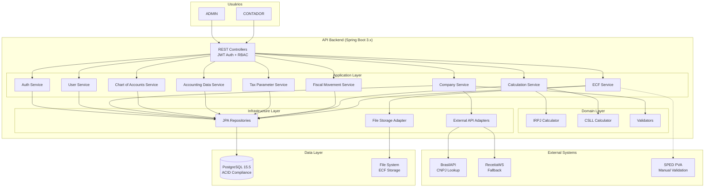
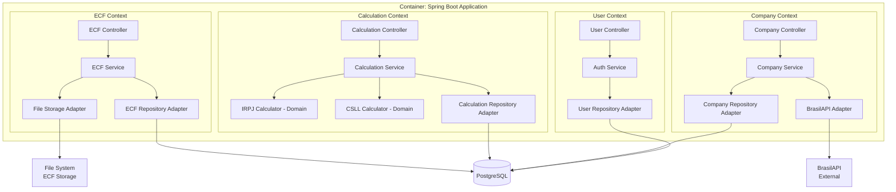
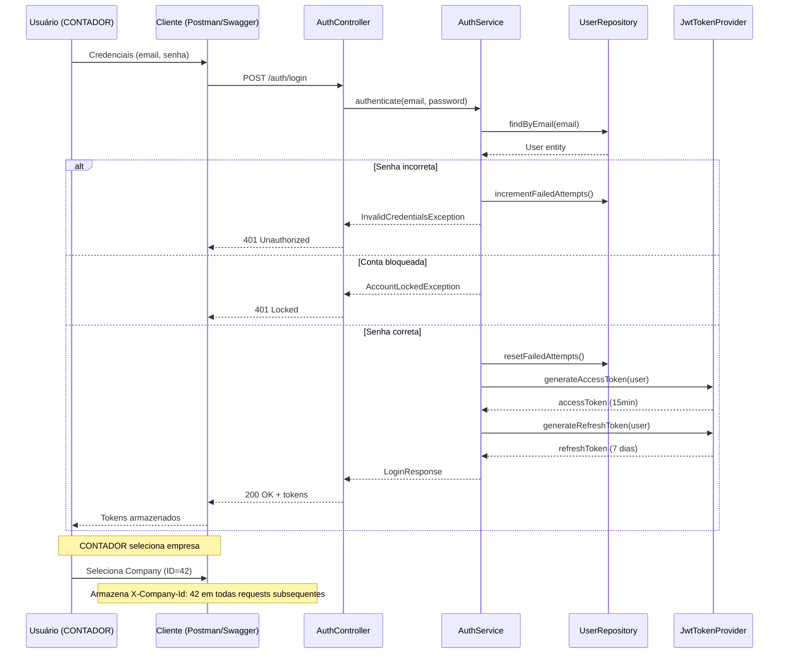
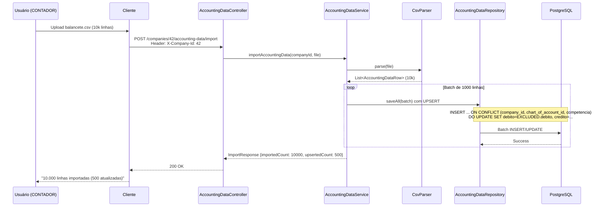
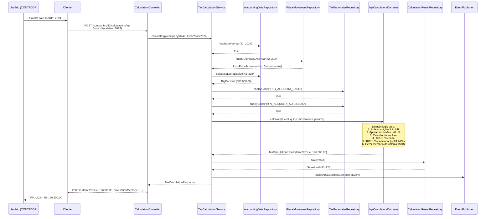
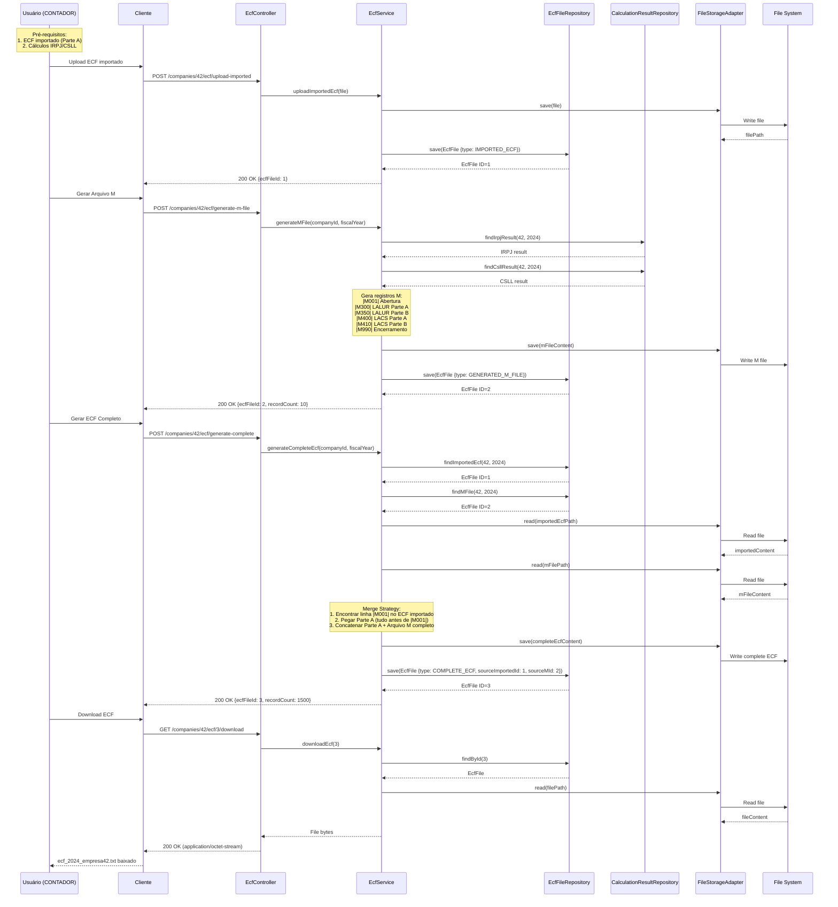
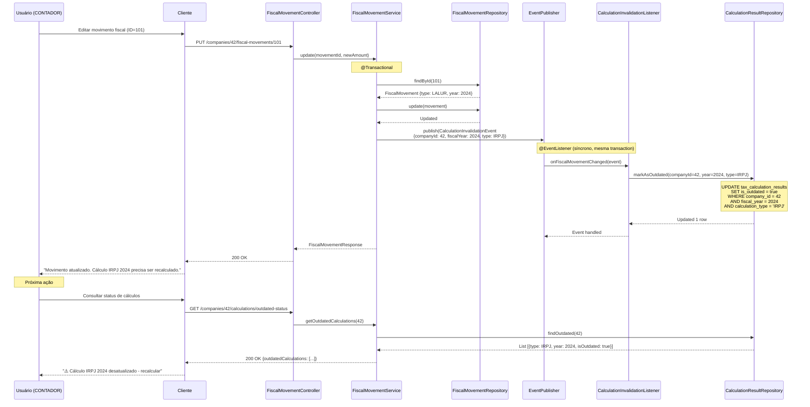

# Sistema LALUR V2 ECF - Documento de Arquitetura

## 1. Introdução

Este documento descreve a arquitetura geral do projeto Sistema LALUR V2 ECF, incluindo sistemas backend, serviços compartilhados e aspectos não específicos de interface de usuário. Seu objetivo primário é servir como blueprint arquitetural orientador para desenvolvimento assistido por IA, garantindo consistência e aderência aos padrões e tecnologias escolhidos.

**Relação com Arquitetura Frontend:**

Este é um sistema **API backend-only** para o MVP. Um documento de Arquitetura Frontend poderá ser criado futuramente quando uma interface de usuário for necessária. As escolhas de tech stack documentadas na Seção 3 deste documento são definitivas para todo o projeto, incluindo quaisquer componentes frontend futuros.

### Decisão: Starter Template ou Projeto Existente

**Decisão:** Sem starter template.

**Justificativa:** A arquitetura hexagonal (Ports & Adapters) requer estrutura customizada de pastas e organização de código que não se alinha bem com starters convencionais (Spring Initializr gera estrutura flat). A estrutura será criada manualmente conforme definido na Seção 10 (Source Tree).

### Change Log

| Data | Versão | Descrição | Autor |
|------|--------|-----------|-------|
| 2025-01-19 | 1.0 | Versão inicial da arquitetura | Winston (Architect Agent) |

---

## 2. Arquitetura de Alto Nível

### Resumo Técnico

O Sistema LALUR V2 ECF é uma **API REST backend monolítica modular** construída com **Java 21 + Spring Boot 3.x**, seguindo **arquitetura hexagonal (Ports & Adapters)** com 8 bounded contexts. O sistema utiliza **PostgreSQL 15+** como banco de dados relacional com conformidade ACID, essencial para garantir integridade em cálculos fiscais (IRPJ/CSLL). A arquitetura é **multi-tenant** (header `X-Company-Id`), com autenticação **JWT stateless** e dois roles (ADMIN e CONTADOR). A solução foi desenhada para atingir os objetivos do PRD: **reduzir tempo de processamento em 70%** (de 8-16h para 2-5h), **precisão >99.5%** nos cálculos tributários, e **suportar múltiplas empresas** de forma escalável. O deploy inicial utiliza **Docker Compose** com PostgreSQL containerizado, e CI/CD via **GitHub Actions**.

### Visão Geral da Arquitetura

1. **Estilo Arquitetural:** Monolito Modular
   - Aplicação única (single deployment)
   - Organização interna em 8 bounded contexts (DDD)
   - Comunicação síncrona entre módulos via chamadas diretas
   - Transações ACID garantidas por banco relacional único

2. **Estrutura de Repositório:** Monorepo
   - Único repositório Git
   - Todos os bounded contexts no mesmo codebase
   - Build único via Maven
   - Deploy único via Docker Compose

3. **Arquitetura de Serviço:** API RESTful Backend
   - Endpoints REST para todas operações (Seção 8 - OpenAPI spec)
   - Stateless (sem sessão server-side)
   - JSON como formato de troca de dados (camelCase convention)

4. **Fluxo de Interação do Usuário (High-Level):**
   ```
   Usuário (Postman/Swagger UI/Frontend futuro)
         ↓
   REST API (Spring Boot) - Autenticação JWT
         ↓
   Application Services (Use Cases) - Orquestração
         ↓
   Domain Services (Calculators) - Lógica de negócio pura
         ↓
   Repository Adapters (JPA) - Persistência
         ↓
   PostgreSQL Database
   ```

5. **Decisões Arquiteturais Chave:**
   - **Hexagonal Architecture:** Isolamento de domínio, testabilidade máxima, flexibilidade para trocar infraestrutura
   - **Monolito Modular vs Microservices:** Simplicidade inicial, deploy único, transações ACID, menor overhead operacional no MVP
   - **PostgreSQL:** Conformidade ACID crítica para cálculos fiscais, suporte robusto a constraints e transações
   - **JWT Stateless:** Escalabilidade horizontal, sem state no servidor, tokens de curta duração (15min access, 7 dias refresh)
   - **Multi-tenant via Header:** Simplicidade (sem schema separation), isolamento lógico via queries filtradas

### Diagrama de Alto Nível



### Padrões Arquiteturais e de Design

- **Hexagonal Architecture (Ports & Adapters):** Isolamento do domínio de detalhes técnicos (frameworks, databases, APIs). Domain layer não conhece Spring/JPA. - _Rationale:_ Garante testabilidade máxima (domain services testáveis sem Spring Context), flexibilidade para trocar infraestrutura (ex: migrar PostgreSQL → MongoDB sem tocar domain), e longevidade do código de negócio.

- **Repository Pattern:** Abstração de acesso a dados via interfaces (ports) implementadas por adapters JPA. - _Rationale:_ Permite testar application services com repositories mockados, e futuramente migrar de JPA para outro mecanismo de persistência sem alterar camadas superiores.

- **Dependency Injection (Spring):** Injeção de dependências via construtores (@RequiredArgsConstructor do Lombok). - _Rationale:_ Inversão de controle facilita testes (injetar mocks), e reduz acoplamento entre componentes.

- **DTO Pattern (Data Transfer Objects):** Separação entre JPA Entities, Domain Models e DTOs de API. - _Rationale:_ Evita expor detalhes internos (lazy loading, campos de auditoria) na API, permite evolução independente de camadas, e previne over-fetching/under-fetching.

- **Soft Delete Pattern:** Status enum (ACTIVE/INACTIVE) em todas entidades ao invés de DELETE físico. - _Rationale:_ Auditoria completa, recovery de dados, conformidade com LGPD (direito ao esquecimento via anonimização após soft delete).

- **Strategy Pattern:** Calculators isolados (IrpjCalculator, CsllCalculator) como estratégias intercambiáveis. - _Rationale:_ Facilita adição de novos tipos de cálculo (ex: PIS/COFINS futuro), testes unitários isolados, e conformidade com Single Responsibility Principle.

- **Command Pattern:** Use Cases representam comandos executáveis (CalculateIrpjUseCase, ImportAccountingDataUseCase). - _Rationale:_ Cada use case é uma unidade atômica de funcionalidade, facilitando auditoria, retry logic, e event sourcing futuro.

- **Event-Driven Architecture (Interno):** Invalidação de cálculos via eventos Spring (ApplicationEventPublisher). - _Rationale:_ Desacoplamento entre módulos (FiscalMovementService publica evento, CalculationService escuta e invalida), extensibilidade (adicionar novos listeners sem modificar código existente).

---

## 3. Stack Tecnológico

### Infraestrutura Cloud

- **Provider:** Cloud-agnostic (deploy inicial Docker Compose local, futuro: AWS/GCP/Azure)
- **Serviços Principais:** Docker Compose 2.24.0 (dev), Container Service gerenciado (prod futuro), PostgreSQL gerenciado (RDS/Cloud SQL/Azure DB)
- **Regiões de Deploy:** Local (dev), Brasil Sul/São Paulo (prod futuro para menor latência)

### Tabela de Tecnologias

| Categoria | Tecnologia | Versão | Propósito | Justificativa |
|-----------|------------|--------|-----------|---------------|
| **Linguagem** | Java | 21 LTS (OpenJDK Temurin 21.0.1) | Linguagem principal backend | LTS até setembro 2029, performance superior (GraalVM-ready), Virtual Threads (Project Loom), records, pattern matching |
| **Framework Backend** | Spring Boot | 3.2.1 | Framework web e DI | Versão estável 3.x com suporte Java 21, ecossistema maduro, produtividade alta |
| **Framework Web** | Spring Web MVC | 6.1.2 | REST API | MVC tradicional (não WebFlux), síncrono, simplicidade para MVP |
| **Persistência** | Spring Data JPA | 3.2.1 | Abstração de repositórios | Repository pattern out-of-the-box, reduz boilerplate |
| **ORM** | Hibernate | 6.4.1 | Mapeamento objeto-relacional | ORM maduro, integração nativa com Spring Data JPA |
| **Segurança** | Spring Security | 6.2.1 | Autenticação e autorização | RBAC, JWT integration, CORS, CSRF protection |
| **Banco de Dados** | PostgreSQL | 15.5 | Database relacional ACID | Conformidade ACID crítica para cálculos fiscais, constraints robustos, JSON support (calculationMemory), open-source |
| **Build Tool** | Maven | 3.9.6 | Gerenciamento de build | Padrão Java enterprise, plugins robustos (JaCoCo, Checkstyle), dependency management |
| **Containerização** | Docker | 25.0.0 | Containerização de app | Portabilidade, isolamento, reprodutibilidade de ambientes |
| **Orquestração Local** | Docker Compose | 2.24.0 | Orquestração multi-container | Setup completo (PostgreSQL + App) com um comando, ideal para dev |
| **JWT** | Auth0 java-jwt | 4.4.0 | Geração e validação de tokens | Biblioteca leve e madura para JWT, suporte HMAC256/RSA |
| **Password Hashing** | BCrypt (Spring Security) | Embutido | Hashing seguro de senhas | Strength 12, resistance a rainbow tables, padrão da indústria |
| **Documentação API** | Springdoc OpenAPI | 2.3.0 | Swagger UI + OpenAPI 3.0 | Auto-geração de docs, UI interativa, especificação OpenAPI exportável |
| **Mapeamento Objetos** | MapStruct | 1.5.5.Final | Entity ↔ Domain ↔ DTO | Performance (compile-time), type-safe, reduz boilerplate vs manual mapping |
| **Redução Boilerplate** | Lombok | 1.18.30 | Getters/setters/builders via annotations | Reduz verbosidade, @Data, @Builder, @Slf4j |
| **Validação** | Hibernate Validator | 8.0.1 (Bean Validation 3.0.2) | Validação de entrada (DTOs) | @NotBlank, @Email, @Size, integração com Spring MVC |
| **Logging** | SLF4J + Logback | 2.0.9 + 1.4.14 | Logging estruturado | SLF4J facade + Logback impl, JSON logs em prod, MDC support |
| **CSV Parsing** | Apache Commons CSV | 1.10.0 | Import/export de balancetes | Parsing robusto de CSV, escape de caracteres, streaming para grandes arquivos |
| **HTTP Client** | WebClient (Spring WebFlux) | 6.1.2 | Chamadas a APIs externas | Assíncrono, timeout configurável, retry policies (BrasilAPI/ReceitaWS) |
| **Testing Framework** | JUnit 5 (Jupiter) | 5.10.1 | Testes unitários e integração | Annotations modernas (@DisplayName), assertions fluentes, extensões |
| **Mocking** | Mockito | 5.8.0 | Mocks em testes unitários | Mature mocking library, integração com JUnit 5 |
| **Integration Testing** | TestContainers | 1.19.3 | PostgreSQL real em testes | Containers efêmeros, testes confiáveis com DB real, CI/CD friendly |
| **Code Coverage** | JaCoCo | 0.8.11 | Relatórios de cobertura | Coverage reports HTML, threshold enforcement (≥70%) |
| **CI/CD** | GitHub Actions | N/A | Pipeline de build/test/deploy | Free para repos públicos, integração nativa GitHub, runners Ubuntu |
| **Code Quality** | Checkstyle | 10.12.5 | Linting e style enforcement | Enforce Google Java Style, falha build se violações |
| **Dependency Check** | OWASP Dependency Check | 8.4.3 | Scan de vulnerabilidades | CVE database, alerta CRITICAL/HIGH vulnerabilities |

**Observações Importantes:**

- **Todas as versões são pinadas** (não usar "latest") para garantir reprodutibilidade de builds
- **Java 21:** Virtual Threads (Project Loom) não serão usados no MVP, mas mantém opção futura
- **Spring Boot 3.x:** Requer Java 17+, utiliza Jakarta EE 9+ (namespace `jakarta.*` vs `javax.*`)
- **PostgreSQL 15.5:** Versão estável com JSONB performance, melhorias em indexes, suporte a `YearMonth` via custom converter
- **Não usar Flyway/Liquibase no MVP:** JPA DDL automático (`ddl-auto: update` em dev, `validate` em prod) - migrar para Flyway se schema evoluir muito
- **WebClient vs RestTemplate:** WebClient é não-bloqueante, mas usado de forma síncrona (`.block()`) no MVP para simplicidade
- **JSON Convention:** camelCase (padrão Java/Jackson) - não forçar snake_case

---

## 4. Modelos de Dados

> **Nota:** Estes modelos são **v1.0** e podem sofrer refinamentos futuros conforme feedback de implementação.

### User (Usuário)

**Propósito:** Representa usuários do sistema (ADMIN e CONTADOR) com autenticação JWT e controle de acesso baseado em roles.

**Atributos Principais:**
- `id`: Long - Identificador único (PK)
- `firstName`: String - Nome do usuário
- `lastName`: String - Sobrenome do usuário
- `email`: String (unique) - Email usado para login
- `password`: String - Hash BCrypt (strength 12)
- `role`: UserRole enum - ADMIN ou CONTADOR
- `mustChangePassword`: Boolean - Flag para forçar troca de senha (default: true)
- `lastLoginAt`: LocalDateTime - Timestamp do último login bem-sucedido (REFINAMENTO v1.0 - segurança)
- `lastFailedLoginAt`: LocalDateTime - Timestamp da última tentativa falhada (REFINAMENTO v1.0)
- `failedLoginAttempts`: Integer - Contador de tentativas falhadas (reset em login bem-sucedido) (REFINAMENTO v1.0)
- `accountLockedUntil`: LocalDateTime - Bloqueio automático após 5 tentativas (15 minutos) (REFINAMENTO v1.0)
- `status`: Status enum - ACTIVE/INACTIVE (soft delete)
- `createdAt`, `updatedAt`, `createdBy`, `updatedBy`: Campos de auditoria (BaseEntity)

**Relacionamentos:**
- Nenhum relacionamento direto (autenticação via email único)

**Decisões de Design:**
- Email como username (simplicidade, padrão da indústria)
- Campos de segurança adicionados no refinamento v1.0 para proteção contra brute force

---

### Company (Empresa)

**Propósito:** Representa empresas gerenciadas no sistema (multi-tenant). CONTADOR acessa apenas suas empresas, ADMIN gerencia todas.

**Atributos Principais:**
- `id`: Long - Identificador único (PK)
- `cnpj`: String (14 dígitos, unique) - CNPJ sem formatação
- `razaoSocial`: String - Razão social oficial
- `nomeFantasia`: String (optional) - Nome fantasia
- `regimeTributario`: RegimeTributario enum - LUCRO_REAL, LUCRO_PRESUMIDO, SIMPLES_NACIONAL
- `periodoContabil`: YearMonth - Período contábil atual (REFINAMENTO v1.0 - formato YYYY-MM, ex: "2024-01")
- `status`: Status enum - ACTIVE/INACTIVE
- `createdAt`, `updatedAt`, `createdBy`, `updatedBy`: Auditoria

**Relacionamentos:**
- One-to-Many com ChartOfAccount
- One-to-Many com AccountingData
- One-to-Many com FiscalMovement
- One-to-Many com TaxCalculationResult
- One-to-Many com EcfFile

**Decisões de Design:**
- `periodoContabil` como YearMonth (não Integer) - validação nativa, queries temporais corretas
- Dados posteriores ao período contábil não podem ser editados (locked)
- CNPJ validado via BrasilAPI/ReceitaWS em criação

---

### ChartOfAccount (Plano de Contas)

**Propósito:** Plano de contas contábil por empresa (estrutura flat, sem hierarquia parent/child para simplicidade).

**Atributos Principais:**
- `id`: Long - PK
- `companyId`: Long - FK para Company
- `code`: String - Código da conta (ex: "1.01.01.001")
- `name`: String - Nome da conta (ex: "Caixa")
- `accountType`: AccountType enum - ATIVO, PASSIVO, PATRIMONIO_LIQUIDO, RECEITA, DESPESA, CUSTO, RESULTADO, COMPENSACAO, ATIVO_RETIFICADORA, PASSIVO_RETIFICADORA (REFINAMENTO v1.0 - expandido)
- `status`: Status enum

**Relacionamentos:**
- Many-to-One com Company
- One-to-Many com AccountingData

**Constraints:**
- Unique constraint (companyId + code) - códigos únicos por empresa

**Decisões de Design:**
- Estrutura flat (sem parent/child) para simplicidade
- AccountType expandido no refinamento v1.0 para cobrir todos casos contábeis

---

### AccountingData (Dados Contábeis)

**Propósito:** Dados mensais de balancete por conta contábil (importados via CSV).

**Atributos Principais:**
- `id`: Long - PK
- `companyId`: Long - FK Company
- `chartOfAccountId`: Long - FK ChartOfAccount
- `competencia`: YearMonth - Competência (YYYY-MM)
- `saldoInicial`: BigDecimal - Saldo inicial
- `debito`: BigDecimal - Total de débitos
- `credito`: BigDecimal - Total de créditos
- `saldoFinal`: BigDecimal - Saldo final
- `status`: Status enum

**Relacionamentos:**
- Many-to-One com Company
- Many-to-One com ChartOfAccount

**Constraints:**
- **CRITICAL Unique constraint (companyId + chartOfAccountId + competencia)** - REFINAMENTO v1.0 - previne duplicatas em importações CSV, permite UPSERT

**Decisões de Design:**
- Constraint única garante idempotência em importações (mesmo CSV 2x = resultado igual)
- BigDecimal para precisão monetária (nunca Float/Double)

---

### TaxParameter (Parâmetro Fiscal)

**Propósito:** Parâmetros fiscais globais gerenciados por ADMIN (ex: alíquotas IRPJ, CSLL, limites).

**Atributos Principais:**
- `id`: Long - PK
- `code`: String (unique) - Código do parâmetro (ex: "IRPJ_ALIQUOTA_BASE")
- `name`: String - Nome legível
- `description`: String - Descrição detalhada
- `category`: String - Categoria (REFINAMENTO v1.0 - ex: "IRPJ", "CSLL", "GERAL") - substituindo hierarquia parent/child
- `valueType`: ValueType enum - PERCENTAGE, FIXED_AMOUNT, TEXT
- `valueText`: String - Valor em formato texto
- `effectiveFrom`: Date - Data de vigência inicial
- `effectiveUntil`: Date (optional) - Data de vigência final (versionamento)
- `status`: Status enum

**Relacionamentos:**
- Nenhum relacionamento direto (parâmetros globais)

**Decisões de Design:**
- `category` field substituindo hierarquia parent/child no refinamento v1.0 - queries mais rápidas, evita recursão
- Versionamento via `effectiveFrom`/`effectiveUntil` para histórico de alíquotas

---

### FiscalMovement (Movimento Fiscal LALUR/LACS)

**Propósito:** Adições e exclusões LALUR (IRPJ) e LACS (CSLL) que ajustam lucro contábil.

**Atributos Principais:**
- `id`: Long - PK
- `companyId`: Long - FK Company
- `movementType`: MovementType enum - LALUR ou LACS
- `classification`: Classification enum - ADICAO ou EXCLUSAO
- `fiscalYear`: Integer - Ano fiscal (ex: 2024)
- `description`: String - Descrição do movimento
- `amount`: BigDecimal - Valor do ajuste
- `legalBasis`: String (optional) - Fundamentação legal
- `status`: Status enum

**Relacionamentos:**
- Many-to-One com Company

**Decisões de Design:**
- Separação LALUR/LACS via enum para queries eficientes
- `legalBasis` opcional mas recomendado para auditoria

---

### TaxCalculationResult (Resultado de Cálculo)

**Propósito:** Armazena resultados de cálculos IRPJ/CSLL com memória de cálculo detalhada.

**Atributos Principais:**
- `id`: Long - PK
- `companyId`: Long - FK Company
- `calculationType`: CalculationType enum - IRPJ ou CSLL
- `fiscalYear`: Integer
- `baseCalculationAmount`: BigDecimal - Lucro Real ou Base CSLL
- `totalTaxDue`: BigDecimal - Imposto total devido
- `calculationMemory`: String (JSON) - Memória de cálculo com `fiscalMovementIds` (REFINAMENTO v1.0 - rastreabilidade)
- `calculatedBy`: String - Email do usuário que executou
- `calculatedAt`: LocalDateTime
- `isOutdated`: Boolean - Flag de invalidação (eventos)
- `status`: Status enum

**Relacionamentos:**
- Many-to-One com Company

**Constraints:**
- Unique constraint (companyId + calculationType + fiscalYear)

**Decisões de Design:**
- `calculationMemory` JSON inclui `fiscalMovementIds` array (refinamento v1.0) para rastrear quais movimentos foram usados
- `isOutdated` flag atualizada via eventos quando FiscalMovements mudam

**Exemplo calculationMemory JSON:**
```json
{
  "calculationId": "calc-123-irpj-2024",
  "timestamp": "2024-01-15T14:30:00Z",
  "calculatedBy": "contador@empresa.com",
  "fiscalMovementIds": [101, 102, 105, 110],
  "steps": [
    {"step": 1, "description": "Lucro Líquido (base inicial)", "value": 500000.00},
    {"step": 2, "description": "Adições LALUR", "value": 50000.00},
    {"step": 3, "description": "Exclusões LALUR", "value": -20000.00},
    {"step": 4, "description": "Lucro Real", "value": 530000.00},
    {"step": 5, "description": "IRPJ 15%", "value": 79500.00},
    {"step": 6, "description": "IRPJ Adicional 10%", "value": 29000.00},
    {"step": 7, "description": "IRPJ Total", "value": 108500.00}
  ]
}
```

---

### EcfFile (Arquivo ECF)

**Propósito:** Representa arquivos ECF (importados Parte A, gerados Parte M, ou completos merged).

**Atributos Principais:**
- `id`: Long - PK
- `companyId`: Long - FK Company
- `fileType`: EcfFileType enum - IMPORTED_ECF, GENERATED_M_FILE, COMPLETE_ECF
- `fileName`: String
- `filePath`: String - Path no filesystem ou S3
- `fileSizeBytes`: Long
- `fiscalYear`: Integer
- `recordCount`: Integer - Número de linhas/registros
- `sourceImportedEcfId`: Long (FK opcional) - Referência ao ECF importado (REFINAMENTO v1.0 - obrigatório se COMPLETE_ECF)
- `sourceMFileId`: Long (FK opcional) - Referência ao M file gerado (REFINAMENTO v1.0 - obrigatório se COMPLETE_ECF)
- `validationStatus`: ValidationStatus enum - NOT_VALIDATED, VALID, INVALID
- `validationErrors`: String (JSON array) - Erros de validação
- `status`: Status enum

**Relacionamentos:**
- Many-to-One com Company
- Self-referential (sourceImportedEcfId, sourceMFileId)

**Constraints:**
- **CHECK constraint (refinamento v1.0):** Se `fileType = COMPLETE_ECF`, então `sourceImportedEcfId` e `sourceMFileId` DEVEM ser NOT NULL

**Decisões de Design:**
- Referências obrigatórias para COMPLETE_ECF garantem rastreabilidade
- `@PrePersist` validation adicional em JPA Entity

---

## 5. Componentes

### Bounded Contexts e Estrutura Hexagonal

O sistema está organizado em **8 bounded contexts** seguindo Domain-Driven Design (DDD). Cada contexto implementa **arquitetura hexagonal** com 3 camadas:

1. **Domain Layer:** Lógica de negócio pura (POJOs, calculators, validators) - sem dependências de frameworks
2. **Application Layer:** Orquestração de casos de uso (services, ports/interfaces)
3. **Infrastructure Layer:** Adapters (REST controllers, JPA repositories, external APIs)

---

#### 1. User Context (Autenticação e Gestão de Usuários)

**Responsabilidade:** Gerenciar autenticação JWT, autorização RBAC (ADMIN/CONTADOR), CRUD de usuários, troca/reset de senhas.

**Principais Interfaces (Ports IN):**
- `AuthenticateUserUseCase` - Login com email/senha, gerar tokens JWT
- `ChangePasswordUseCase` - Troca de senha obrigatória (primeiro acesso)
- `CreateUserUseCase` - ADMIN cria usuários (ADMIN ou CONTADOR)
- `ListUsersUseCase` - Listar usuários com paginação e busca
- `GetUserUseCase` - Visualizar detalhes de usuário
- `UpdateUserUseCase` - Editar dados de usuário
- `ToggleUserStatusUseCase` - Ativar/inativar usuário (soft delete)
- `ResetUserPasswordUseCase` - ADMIN redefine senha (força `mustChangePassword=true`)

**Dependências:**
- `UserRepositoryPort` (acesso a database)
- `BCryptPasswordEncoder` (hashing de senhas)
- `JwtTokenProvider` (geração/validação de tokens)

**Stack Tecnológico:**
- Spring Security 6.2.1 (RBAC, @PreAuthorize)
- Auth0 java-jwt 4.4.0 (JWT)
- BCrypt strength 12

**Endpoints REST:**
- `POST /api/v1/auth/login` - Login (public)
- `POST /api/v1/auth/change-password` - Trocar senha (autenticado)
- `POST /api/v1/users` - Criar usuário (ADMIN only)
- `GET /api/v1/users` - Listar usuários (ADMIN only)
- `GET /api/v1/users/{id}` - Visualizar usuário (ADMIN only)
- `PUT /api/v1/users/{id}` - Editar usuário (ADMIN only)
- `PATCH /api/v1/users/{id}/status` - Toggle status (ADMIN only)
- `POST /api/v1/users/{id}/reset-password` - Reset senha (ADMIN only)

---

#### 2. Company Context (Gestão de Empresas)

**Responsabilidade:** CRUD de empresas, validação de CNPJ via APIs externas (BrasilAPI/ReceitaWS), gestão de período contábil.

**Principais Interfaces:**
- `CreateCompanyUseCase` - Criar empresa com validação CNPJ
- `SearchCnpjUseCase` - Buscar dados de CNPJ em APIs externas
- `UpdatePeriodoContabilUseCase` - Atualizar período contábil (lock de dados)
- `ListCompaniesUseCase` - Listar empresas (ADMIN: todas, CONTADOR: apenas suas)
- `GetCompanyUseCase` - Visualizar detalhes de empresa

**Dependências:**
- `CompanyRepositoryPort`
- `CnpjApiPort` (abstração BrasilAPI/ReceitaWS)

**Stack Tecnológico:**
- Spring WebClient 6.1.2 (chamadas HTTP assíncronas)
- BrasilAPI: `https://brasilapi.com.br/api/cnpj/v1/{cnpj}` (timeout 10s)
- ReceitaWS (fallback): `https://www.receitaws.com.br/v1/cnpj/{cnpj}` (timeout 15s)

**Endpoints REST:**
- `POST /api/v1/companies` - Criar empresa
- `GET /api/v1/companies` - Listar empresas
- `GET /api/v1/companies/{id}` - Visualizar empresa
- `PUT /api/v1/companies/{id}` - Editar empresa
- `PATCH /api/v1/companies/{id}/periodo-contabil` - Atualizar período
- `GET /api/v1/companies/search-cnpj/{cnpj}` - Buscar CNPJ (BrasilAPI)

**Integração Externa - BrasilAPI/ReceitaWS:**
```java
@Component
public class BrasilApiCnpjAdapter implements CnpjApiPort {
    private final WebClient webClient;

    @Cacheable(value = "cnpjCache", key = "#cnpj")
    public Optional<CnpjData> searchCnpj(String cnpj) {
        try {
            return webClient.get()
                .uri("/cnpj/v1/{cnpj}", cnpj)
                .retrieve()
                .bodyToMono(CnpjResponse.class)
                .timeout(Duration.ofSeconds(10))
                .blockOptional();
        } catch (TimeoutException e) {
            return receitaWsFallback.searchCnpj(cnpj); // Fallback
        }
    }
}
```

---

#### 3. Chart of Accounts Context (Plano de Contas)

**Responsabilidade:** Importar/exportar plano de contas via CSV, CRUD de contas contábeis.

**Principais Interfaces:**
- `ImportChartOfAccountsUseCase` - Upload CSV com plano de contas
- `ExportChartOfAccountsUseCase` - Download CSV do plano atual
- `CreateChartOfAccountUseCase` - Criar conta individual
- `ListChartOfAccountsUseCase` - Listar contas por empresa

**Dependências:**
- `ChartOfAccountRepositoryPort`
- `CsvParser` (Apache Commons CSV)

**Stack Tecnológico:**
- Apache Commons CSV 1.10.0

**Endpoints REST:**
- `POST /api/v1/companies/{companyId}/chart-of-accounts/import` - Upload CSV
- `GET /api/v1/companies/{companyId}/chart-of-accounts/export` - Download CSV
- `POST /api/v1/companies/{companyId}/chart-of-accounts` - Criar conta
- `GET /api/v1/companies/{companyId}/chart-of-accounts` - Listar contas

**Formato CSV:**
```csv
code,name,accountType
1.01.01.001,Caixa,ATIVO
1.01.01.002,Bancos,ATIVO
2.01.01.001,Fornecedores,PASSIVO
```

---

#### 4. Tax Parameter Context (Parâmetros Fiscais)

**Responsabilidade:** CRUD de parâmetros fiscais globais (ADMIN only) - alíquotas, limites, configurações.

**Principais Interfaces:**
- `ManageTaxParametersUseCase` - CRUD completo de parâmetros

**Dependências:**
- `TaxParameterRepositoryPort`

**Endpoints REST:**
- `POST /api/v1/tax-parameters` - Criar parâmetro (ADMIN)
- `GET /api/v1/tax-parameters` - Listar parâmetros (ADMIN)
- `PUT /api/v1/tax-parameters/{id}` - Editar parâmetro (ADMIN)
- `DELETE /api/v1/tax-parameters/{id}` - Inativar parâmetro (ADMIN)

**Seed Data (Inicialização):**
- IRPJ_ALIQUOTA_BASE: 15%
- IRPJ_ALIQUOTA_ADICIONAL: 10%
- IRPJ_LIMITE_ADICIONAL_MENSAL: R$ 20.000
- CSLL_ALIQUOTA: 9%

---

#### 5. Accounting Data Context (Dados Contábeis)

**Responsabilidade:** Importar/exportar dados contábeis mensais (balancetes) via CSV com UPSERT automático.

**Principais Interfaces:**
- `ImportAccountingDataUseCase` - Upload CSV de balancete (UPSERT via unique constraint)
- `ExportAccountingDataUseCase` - Download CSV de período específico
- `ListAccountingDataUseCase` - Listar dados por período

**Dependências:**
- `AccountingDataRepositoryPort`
- `ChartOfAccountRepositoryPort` (validar contas existem)
- `CsvParser`

**Endpoints REST:**
- `POST /api/v1/companies/{companyId}/accounting-data/import` - Upload CSV
- `GET /api/v1/companies/{companyId}/accounting-data/export` - Download CSV
- `GET /api/v1/companies/{companyId}/accounting-data` - Listar dados

**Performance:**
- Batch inserts (1000 linhas por transaction)
- UPSERT via `INSERT ... ON CONFLICT UPDATE` (PostgreSQL)
- Target: 10k linhas em < 30s

**Formato CSV:**
```csv
chartOfAccountCode,competencia,saldoInicial,debito,credito,saldoFinal
1.01.01.001,2024-01,50000.00,10000.00,5000.00,55000.00
1.01.01.002,2024-01,100000.00,20000.00,15000.00,105000.00
```

---

#### 6. LALUR Context (Movimentos Fiscais)

**Responsabilidade:** CRUD de adições/exclusões LALUR e LACS, publicação de eventos de invalidação de cálculos.

**Principais Interfaces:**
- `CreateFiscalMovementUseCase` - Criar movimento (publica evento)
- `UpdateFiscalMovementUseCase` - Editar movimento (publica evento)
- `DeleteFiscalMovementUseCase` - Inativar movimento (publica evento)
- `ListFiscalMovementsUseCase` - Listar por empresa e ano

**Dependências:**
- `FiscalMovementRepositoryPort`
- `CalculationInvalidationEventPublisher`

**Endpoints REST:**
- `POST /api/v1/companies/{companyId}/fiscal-movements` - Criar movimento
- `GET /api/v1/companies/{companyId}/fiscal-movements` - Listar
- `PUT /api/v1/companies/{companyId}/fiscal-movements/{id}` - Editar
- `DELETE /api/v1/companies/{companyId}/fiscal-movements/{id}` - Inativar

**Event-Driven Invalidation:**
```java
@Service
public class FiscalMovementService {

    @Transactional
    public FiscalMovement create(CreateFiscalMovementCommand cmd) {
        FiscalMovement movement = repository.save(cmd.toDomain());

        // Publicar evento para invalidar cálculos
        eventPublisher.publish(new CalculationInvalidationEvent(
            cmd.getCompanyId(),
            cmd.getFiscalYear(),
            movement.getMovementType() // LALUR ou LACS
        ));

        return movement;
    }
}
```

---

#### 7. Calculation Context (Motores de Cálculo)

**Responsabilidade:** Calcular IRPJ/CSLL usando IrpjCalculator e CsllCalculator (domain services puros), invalidar cálculos desatualizados via eventos.

**Principais Interfaces:**
- `CalculateIrpjUseCase` - Calcular IRPJ para ano fiscal
- `CalculateCsllUseCase` - Calcular CSLL para ano fiscal
- `RecalculateAllUseCase` - Recalcular todos cálculos outdated
- `GetOutdatedCalculationsUseCase` - Listar cálculos desatualizados

**Dependências:**
- `TaxCalculationResultRepositoryPort`
- `FiscalMovementRepositoryPort`
- `AccountingDataRepositoryPort`
- `TaxParameterRepositoryPort`
- `IrpjCalculator` (domain service)
- `CsllCalculator` (domain service)

**Domain Services (Pure Logic):**
```java
// domain/service/calculator/IrpjCalculator.java
public class IrpjCalculator {

    public TaxCalculationResult calculate(CalculationInput input) {
        BigDecimal lucroContabil = input.getLucroLiquido();
        List<FiscalMovement> movements = input.getMovements();

        // Aplicar adições e exclusões
        BigDecimal lucroReal = lucroContabil;
        for (FiscalMovement m : movements) {
            if (m.getClassification() == ADICAO) {
                lucroReal = lucroReal.add(m.getAmount());
            } else {
                lucroReal = lucroReal.subtract(m.getAmount());
            }
        }

        // IRPJ base: 15%
        BigDecimal irpjBase = lucroReal.multiply(new BigDecimal("0.15"));

        // IRPJ adicional: 10% sobre parcela > R$ 240k/ano
        BigDecimal threshold = new BigDecimal("240000");
        BigDecimal irpjAdicional = lucroReal.compareTo(threshold) > 0
            ? lucroReal.subtract(threshold).multiply(new BigDecimal("0.10"))
            : BigDecimal.ZERO;

        BigDecimal totalIrpj = irpjBase.add(irpjAdicional);

        return new TaxCalculationResult(lucroReal, totalIrpj, buildMemory(...));
    }
}
```

**Endpoints REST:**
- `POST /api/v1/companies/{companyId}/calculations/irpj` - Calcular IRPJ
- `POST /api/v1/companies/{companyId}/calculations/csll` - Calcular CSLL
- `POST /api/v1/companies/{companyId}/calculations/recalculate-all` - Recalcular outdated
- `GET /api/v1/companies/{companyId}/calculations/outdated-status` - Status de desatualização

**Event Listener (Invalidação Automática):**
```java
@Component
public class CalculationInvalidationListener {

    @EventListener
    @Transactional
    public void onFiscalMovementChanged(CalculationInvalidationEvent event) {
        // Marcar cálculos como outdated
        calculationRepository.markAsOutdated(
            event.getCompanyId(),
            event.getFiscalYear(),
            event.getCalculationType()
        );

        log.info("Cálculos invalidados: company={}, year={}, type={}",
            event.getCompanyId(), event.getFiscalYear(), event.getCalculationType());
    }
}
```

---

#### 8. ECF Context (Geração e Validação de ECF)

**Responsabilidade:** Upload de ECF importado (Parte A), geração de arquivo M (Parte M com LALUR/LACS), merge para ECF completo, validação interna, download.

**Principais Interfaces:**
- `UploadImportedEcfUseCase` - Upload arquivo ECF importado
- `GenerateMFileUseCase` - Gerar arquivo M completo (M001 + M300 + M350 + M400 + M410 + M990)
- `GenerateCompleteEcfUseCase` - Merge ECF importado + M file (substituição simples em |M001|)
- `ValidateEcfUseCase` - Validação interna (regras básicas)
- `DownloadEcfUseCase` - Download de arquivo gerado

**Dependências:**
- `EcfFileRepositoryPort`
- `TaxCalculationResultRepositoryPort`
- `FileStoragePort` (abstração filesystem/S3)
- `EcfFileParser`

**Endpoints REST:**
- `POST /api/v1/companies/{companyId}/ecf/upload-imported` - Upload ECF (Parte A)
- `POST /api/v1/companies/{companyId}/ecf/generate-m-file` - Gerar M file
- `POST /api/v1/companies/{companyId}/ecf/generate-complete` - Gerar ECF completo
- `POST /api/v1/companies/{companyId}/ecf/{fileId}/validate` - Validar
- `GET /api/v1/companies/{companyId}/ecf/{fileId}/download` - Download

**Merge Strategy (Simple Replacement):**
```
linhasEcfImportado = lerArquivo(ecfImportado)
linhasArquivoM = lerArquivo(arquivoM)

indexM001 = encontrarPrimeiraLinha(linhasEcfImportado, inicia com "|M001|")

se (indexM001 encontrado):
    parteA = linhasEcfImportado[0 até indexM001-1]  // Tudo antes de M001
senão:
    parteA = linhasEcfImportado  // Arquivo completo (não tinha Parte M)

ecfCompleto = parteA + linhasArquivoM
salvar(ecfCompleto)
```

---

### Diagrama de Componentes (C4 Container)



---

## 6. APIs Externas

### BrasilAPI (Primary CNPJ Lookup)

- **Propósito:** Buscar dados cadastrais de CNPJ (razão social, situação cadastral, endereço)
- **Documentação:** https://brasilapi.com.br/docs#tag/CNPJ
- **Base URL:** `https://brasilapi.com.br/api`
- **Autenticação:** Nenhuma (API pública)
- **Rate Limits:** Não documentado oficialmente (~100 req/min estimado)

**Endpoints Utilizados:**
- `GET /cnpj/v1/{cnpj}` - Buscar dados de CNPJ (14 dígitos sem formatação)

**Exemplo de Resposta:**
```json
{
  "cnpj": "19131243000197",
  "razao_social": "EMPRESAS TESTE LTDA",
  "nome_fantasia": "TESTE",
  "cnae_fiscal": 6204000,
  "cnae_fiscal_descricao": "Consultoria em tecnologia da informação",
  "situacao_cadastral": "ATIVA",
  "data_situacao_cadastral": "2005-11-03",
  "municipio": "SAO PAULO",
  "uf": "SP"
}
```

**Notas de Integração:**
- Timeout: 10 segundos (read timeout)
- Retry: 3 tentativas com exponential backoff (2s, 4s)
- Fallback: ReceitaWS em caso de timeout/503
- Cache: Redis 24h TTL (futuro - otimização)

---

### ReceitaWS API (Fallback CNPJ)

- **Propósito:** Fallback quando BrasilAPI falha/timeout
- **Documentação:** https://receitaws.com.br/api
- **Base URL:** `https://www.receitaws.com.br/v1`
- **Autenticação:** Nenhuma (API pública)
- **Rate Limits:** 3 requests/minuto (muito restritivo - por isso é fallback)

**Endpoints Utilizados:**
- `GET /cnpj/{cnpj}` - Buscar CNPJ

**Exemplo de Resposta:**
```json
{
  "cnpj": "19.131.243/0001-97",
  "nome": "EMPRESAS TESTE LTDA",
  "fantasia": "TESTE",
  "atividade_principal": [
    {
      "code": "62.04-0-00",
      "text": "Consultoria em tecnologia da informação"
    }
  ],
  "situacao": "ATIVA",
  "municipio": "SAO PAULO",
  "uf": "SP"
}
```

**Notas de Integração:**
- Timeout: 15 segundos (API mais lenta que BrasilAPI)
- Apenas usado em fallback (não primário devido a rate limits)
- Log WARN quando fallback ativado

---

### SPED PVA (Manual Validation)

- **Propósito:** Validação final do ECF gerado antes de transmissão oficial (software desktop Receita Federal)
- **Tipo:** Software desktop offline - SEM integração automatizada
- **Download:** https://www.gov.br/receitafederal/pt-br/assuntos/orientacao-tributaria/declaracoes-e-demonstrativos/ecf

**Processo Manual:**
1. Sistema gera ECF completo (.txt)
2. Usuário faz download do arquivo
3. Usuário abre SPED PVA (software desktop)
4. Usuário importa arquivo no PVA
5. PVA valida e aponta erros (se houver)
6. Usuário corrige dados no sistema, gera novo ECF
7. Repetir até PVA validar com sucesso
8. Usuário transmite via PVA (assinatura digital e-CPF/e-CNPJ)

**Validações Internas (Sistema):**
Sistema implementa ~80% das validações do PVA internamente:
- Campos obrigatórios preenchidos
- Formatos de registros corretos (pipe-delimited)
- Sequência de registros (M001 → M300 → M990)
- Somatórias de valores
- CNPJ válido

**Limitações:**
- Não valida assinatura digital (PVA)
- Não valida regras complexas da Receita (atualizadas frequentemente)
- Validação interna reduz ~80% dos erros, mas PVA é obrigatório para transmissão

---

## 7. Workflows Principais

### 1. Login e Seleção de Empresa



---

### 2. Importação de Balancete CSV



**Performance:**
- Batch size: 1000 linhas por transaction
- UPSERT via unique constraint (idempotente)
- Target: 10k linhas em < 30s

---

### 3. Cálculo IRPJ



**Memória de Cálculo JSON:**
```json
{
  "calculationId": "calc-123-irpj-2024",
  "fiscalMovementIds": [101, 102, 105, 110, 115, 120, 125, 130, 135, 140],
  "steps": [
    {"step": 1, "description": "Lucro Líquido Contábil", "value": 500000.00},
    {"step": 2, "description": "Adições LALUR (10 movimentos)", "value": 50000.00},
    {"step": 3, "description": "Exclusões LALUR", "value": -20000.00},
    {"step": 4, "description": "Lucro Real (Base de Cálculo)", "value": 530000.00},
    {"step": 5, "description": "IRPJ Base 15%", "value": 79500.00},
    {"step": 6, "description": "IRPJ Adicional 10% (sobre R$ 290k)", "value": 29000.00},
    {"step": 7, "description": "IRPJ Total Devido", "value": 108500.00}
  ]
}
```

---

### 4. Geração de ECF Completo



---

### 5. Invalidação Automática de Cálculos



---

## 8. Especificação da API REST (OpenAPI 3.0)

```yaml
openapi: 3.0.0
info:
  title: Sistema LALUR V2 ECF - API
  version: 1.0.0
  description: |
    API REST para cálculo de IRPJ/CSLL e geração de arquivos ECF para empresas no regime de Lucro Real.

    **Autenticação:** JWT Bearer token (header `Authorization: Bearer <token>`)

    **Multi-tenancy:** Header `X-Company-Id` obrigatório para role CONTADOR

    **Convenções:**
    - JSON camelCase
    - Timestamps ISO-8601 (UTC)
    - Erros RFC 7807 (Problem Details)

  contact:
    name: Suporte Técnico
    email: suporte@lalurecf.com.br

servers:
  - url: http://localhost:8080/api/v1
    description: Desenvolvimento Local
  - url: https://api-staging.lalurecf.com.br/api/v1
    description: Staging (Futuro)
  - url: https://api.lalurecf.com.br/api/v1
    description: Produção (Futuro)

tags:
  - name: Authentication
    description: Login e gestão de tokens JWT
  - name: Users
    description: Gestão de usuários (ADMIN only)
  - name: Companies
    description: Gestão de empresas
  - name: Chart of Accounts
    description: Plano de contas
  - name: Accounting Data
    description: Dados contábeis (balancetes)
  - name: Tax Parameters
    description: Parâmetros fiscais globais (ADMIN only)
  - name: Fiscal Movements
    description: Movimentos LALUR/LACS
  - name: Calculations
    description: Cálculos IRPJ/CSLL
  - name: ECF
    description: Geração e validação de ECF

security:
  - BearerAuth: []

components:
  securitySchemes:
    BearerAuth:
      type: http
      scheme: bearer
      bearerFormat: JWT
      description: |
        JWT token obtido via `/auth/login`.

        Access token expira em 15 minutos.
        Refresh token expira em 7 dias.

  parameters:
    CompanyIdHeader:
      name: X-Company-Id
      in: header
      required: true
      description: ID da empresa (obrigatório para CONTADOR)
      schema:
        type: integer
        format: int64
        example: 42

    PageParam:
      name: page
      in: query
      description: Número da página (0-indexed)
      schema:
        type: integer
        default: 0
        minimum: 0

    SizeParam:
      name: size
      in: query
      description: Tamanho da página
      schema:
        type: integer
        default: 50
        minimum: 1
        maximum: 100

    SortParam:
      name: sort
      in: query
      description: Ordenação (campo,direção)
      schema:
        type: string
        example: "createdAt,desc"

  schemas:
    # ========== Authentication Schemas ==========
    LoginRequest:
      type: object
      required: [email, password]
      properties:
        email:
          type: string
          format: email
          example: "contador@empresa.com.br"
        password:
          type: string
          format: password
          minLength: 8
          example: "SenhaSegura123"

    LoginResponse:
      type: object
      properties:
        accessToken:
          type: string
          example: "eyJhbGciOiJIUzI1NiIsInR5cCI6IkpXVCJ9..."
        refreshToken:
          type: string
          example: "eyJhbGciOiJIUzI1NiIsInR5cCI6IkpXVCJ9..."
        email:
          type: string
          example: "contador@empresa.com.br"
        firstName:
          type: string
          example: "João"
        lastName:
          type: string
          example: "Silva"
        role:
          type: string
          enum: [ADMIN, CONTADOR]
          example: "CONTADOR"
        mustChangePassword:
          type: boolean
          example: false

    ChangePasswordRequest:
      type: object
      required: [currentPassword, newPassword]
      properties:
        currentPassword:
          type: string
          format: password
        newPassword:
          type: string
          format: password
          minLength: 8

    ChangePasswordResponse:
      type: object
      properties:
        success:
          type: boolean
        message:
          type: string
          example: "Senha alterada com sucesso"

    # ========== User Schemas ==========
    CreateUserRequest:
      type: object
      required: [firstName, lastName, email, password, role]
      properties:
        firstName:
          type: string
          minLength: 2
          maxLength: 100
          example: "Maria"
        lastName:
          type: string
          minLength: 2
          maxLength: 100
          example: "Santos"
        email:
          type: string
          format: email
          example: "maria@empresa.com.br"
        password:
          type: string
          format: password
          minLength: 8
          example: "SenhaTemporaria123"
        role:
          type: string
          enum: [ADMIN, CONTADOR]
          example: "CONTADOR"

    UserResponse:
      type: object
      properties:
        id:
          type: integer
          format: int64
          example: 1
        firstName:
          type: string
          example: "Maria"
        lastName:
          type: string
          example: "Santos"
        email:
          type: string
          example: "maria@empresa.com.br"
        role:
          type: string
          enum: [ADMIN, CONTADOR]
        status:
          type: string
          enum: [ACTIVE, INACTIVE]
        mustChangePassword:
          type: boolean
        lastLoginAt:
          type: string
          format: date-time
          nullable: true
        createdAt:
          type: string
          format: date-time
        updatedAt:
          type: string
          format: date-time

    ToggleStatusRequest:
      type: object
      required: [status]
      properties:
        status:
          type: string
          enum: [ACTIVE, INACTIVE]

    ResetPasswordRequest:
      type: object
      required: [temporaryPassword]
      properties:
        temporaryPassword:
          type: string
          format: password
          minLength: 8

    # ========== Company Schemas ==========
    CreateCompanyRequest:
      type: object
      required: [cnpj, razaoSocial, regimeTributario, periodoContabil]
      properties:
        cnpj:
          type: string
          pattern: '^\d{14}$'
          example: "12345678000195"
        razaoSocial:
          type: string
          minLength: 3
          maxLength: 255
          example: "EMPRESA TESTE LTDA"
        nomeFantasia:
          type: string
          maxLength: 255
          example: "Empresa Teste"
        regimeTributario:
          type: string
          enum: [LUCRO_REAL, LUCRO_PRESUMIDO, SIMPLES_NACIONAL]
          example: "LUCRO_REAL"
        periodoContabil:
          type: string
          pattern: '^\d{4}-(0[1-9]|1[0-2])$'
          example: "2024-01"

    CompanyResponse:
      type: object
      properties:
        id:
          type: integer
          format: int64
        cnpj:
          type: string
        razaoSocial:
          type: string
        nomeFantasia:
          type: string
        regimeTributario:
          type: string
        periodoContabil:
          type: string
        status:
          type: string
        createdAt:
          type: string
          format: date-time
        updatedAt:
          type: string
          format: date-time

    CnpjSearchResponse:
      type: object
      properties:
        cnpj:
          type: string
        razaoSocial:
          type: string
        nomeFantasia:
          type: string
        situacaoCadastral:
          type: string
        municipio:
          type: string
        uf:
          type: string
        source:
          type: string
          enum: [BRASIL_API, RECEITA_WS]

    # ========== Calculation Schemas ==========
    CalculateIrpjRequest:
      type: object
      required: [fiscalYear]
      properties:
        fiscalYear:
          type: integer
          minimum: 2000
          maximum: 2100
          example: 2024

    TaxCalculationResponse:
      type: object
      properties:
        calculationId:
          type: integer
          format: int64
        calculationType:
          type: string
          enum: [IRPJ, CSLL]
        fiscalYear:
          type: integer
        baseCalculationAmount:
          type: number
          format: double
          example: 530000.00
        totalTaxDue:
          type: number
          format: double
          example: 108500.00
        calculationMemory:
          type: string
          description: JSON string com steps detalhados
        isOutdated:
          type: boolean
        calculatedBy:
          type: string
        calculatedAt:
          type: string
          format: date-time

    OutdatedCalculationsResponse:
      type: object
      properties:
        companyId:
          type: integer
          format: int64
        outdatedCalculations:
          type: array
          items:
            type: object
            properties:
              calculationType:
                type: string
              fiscalYear:
                type: integer
              isOutdated:
                type: boolean
              lastCalculatedAt:
                type: string
                format: date-time

    # ========== ECF Schemas ==========
    GenerateMFileRequest:
      type: object
      required: [fiscalYear]
      properties:
        fiscalYear:
          type: integer
          example: 2024

    GenerateMFileResponse:
      type: object
      properties:
        ecfFileId:
          type: integer
          format: int64
        fileName:
          type: string
          example: "M_2024_empresa42.txt"
        recordCount:
          type: integer
          example: 10
        fileSizeBytes:
          type: integer
          format: int64

    GenerateCompleteEcfRequest:
      type: object
      required: [fiscalYear]
      properties:
        fiscalYear:
          type: integer

    ValidateEcfResponse:
      type: object
      properties:
        ecfFileId:
          type: integer
          format: int64
        validationStatus:
          type: string
          enum: [VALID, INVALID]
        errors:
          type: array
          items:
            type: object
            properties:
              line:
                type: integer
              field:
                type: string
              message:
                type: string

    EcfFileResponse:
      type: object
      properties:
        id:
          type: integer
          format: int64
        companyId:
          type: integer
          format: int64
        fileType:
          type: string
          enum: [IMPORTED_ECF, GENERATED_M_FILE, COMPLETE_ECF]
        fileName:
          type: string
        fiscalYear:
          type: integer
        recordCount:
          type: integer
        validationStatus:
          type: string
        createdAt:
          type: string
          format: date-time

    # ========== Common Schemas ==========
    ErrorResponse:
      type: object
      properties:
        type:
          type: string
          example: "https://api.lalurecf.com.br/errors/validation-error"
        title:
          type: string
          example: "Validation Error"
        status:
          type: integer
          example: 400
        detail:
          type: string
          example: "CNPJ inválido"
        instance:
          type: string
          example: "/api/v1/companies"
        timestamp:
          type: string
          format: date-time
        correlationId:
          type: string
          format: uuid
        errors:
          type: array
          items:
            type: object
            properties:
              field:
                type: string
              message:
                type: string

    PageResponse:
      type: object
      properties:
        content:
          type: array
          items:
            type: object
        totalElements:
          type: integer
          format: int64
        totalPages:
          type: integer
        size:
          type: integer
        number:
          type: integer

paths:
  # ========== Authentication Endpoints ==========
  /auth/login:
    post:
      tags: [Authentication]
      summary: Login com email e senha
      description: Autentica usuário e retorna tokens JWT (access + refresh)
      operationId: login
      security: []
      requestBody:
        required: true
        content:
          application/json:
            schema:
              $ref: '#/components/schemas/LoginRequest'
      responses:
        '200':
          description: Login bem-sucedido
          content:
            application/json:
              schema:
                $ref: '#/components/schemas/LoginResponse'
        '401':
          description: Credenciais inválidas ou conta bloqueada
          content:
            application/json:
              schema:
                $ref: '#/components/schemas/ErrorResponse'
        '400':
          description: Dados de entrada inválidos
          content:
            application/json:
              schema:
                $ref: '#/components/schemas/ErrorResponse'

  /auth/change-password:
    post:
      tags: [Authentication]
      summary: Trocar senha
      description: Troca senha do usuário autenticado (obrigatório em primeiro acesso)
      operationId: changePassword
      requestBody:
        required: true
        content:
          application/json:
            schema:
              $ref: '#/components/schemas/ChangePasswordRequest'
      responses:
        '200':
          description: Senha alterada com sucesso
          content:
            application/json:
              schema:
                $ref: '#/components/schemas/ChangePasswordResponse'
        '400':
          description: Senha atual incorreta ou nova senha inválida
          content:
            application/json:
              schema:
                $ref: '#/components/schemas/ErrorResponse'

  # ========== User Endpoints ==========
  /users:
    post:
      tags: [Users]
      summary: Criar usuário (ADMIN only)
      description: ADMIN cria novo usuário (ADMIN ou CONTADOR)
      operationId: createUser
      security:
        - BearerAuth: []
      requestBody:
        required: true
        content:
          application/json:
            schema:
              $ref: '#/components/schemas/CreateUserRequest'
      responses:
        '201':
          description: Usuário criado com sucesso
          content:
            application/json:
              schema:
                $ref: '#/components/schemas/UserResponse'
        '400':
          description: Email duplicado ou dados inválidos
          content:
            application/json:
              schema:
                $ref: '#/components/schemas/ErrorResponse'
        '403':
          description: Acesso negado (apenas ADMIN)
          content:
            application/json:
              schema:
                $ref: '#/components/schemas/ErrorResponse'

    get:
      tags: [Users]
      summary: Listar usuários (ADMIN only)
      description: Lista usuários com paginação e busca
      operationId: listUsers
      security:
        - BearerAuth: []
      parameters:
        - $ref: '#/components/parameters/PageParam'
        - $ref: '#/components/parameters/SizeParam'
        - $ref: '#/components/parameters/SortParam'
        - name: search
          in: query
          description: Buscar por nome (firstName ou lastName)
          schema:
            type: string
        - name: includeInactive
          in: query
          description: Incluir usuários inativos
          schema:
            type: boolean
            default: false
      responses:
        '200':
          description: Lista de usuários
          content:
            application/json:
              schema:
                $ref: '#/components/schemas/PageResponse'
        '403':
          description: Acesso negado
          content:
            application/json:
              schema:
                $ref: '#/components/schemas/ErrorResponse'

  /users/{id}:
    get:
      tags: [Users]
      summary: Visualizar usuário (ADMIN only)
      operationId: getUser
      security:
        - BearerAuth: []
      parameters:
        - name: id
          in: path
          required: true
          schema:
            type: integer
            format: int64
      responses:
        '200':
          description: Detalhes do usuário
          content:
            application/json:
              schema:
                $ref: '#/components/schemas/UserResponse'
        '404':
          description: Usuário não encontrado
          content:
            application/json:
              schema:
                $ref: '#/components/schemas/ErrorResponse'

    put:
      tags: [Users]
      summary: Editar usuário (ADMIN only)
      operationId: updateUser
      security:
        - BearerAuth: []
      parameters:
        - name: id
          in: path
          required: true
          schema:
            type: integer
            format: int64
      requestBody:
        required: true
        content:
          application/json:
            schema:
              $ref: '#/components/schemas/CreateUserRequest'
      responses:
        '200':
          description: Usuário atualizado
          content:
            application/json:
              schema:
                $ref: '#/components/schemas/UserResponse'
        '404':
          description: Usuário não encontrado

  /users/{id}/status:
    patch:
      tags: [Users]
      summary: Alternar status do usuário (ADMIN only)
      description: Ativar ou inativar usuário (soft delete)
      operationId: toggleUserStatus
      security:
        - BearerAuth: []
      parameters:
        - name: id
          in: path
          required: true
          schema:
            type: integer
            format: int64
      requestBody:
        required: true
        content:
          application/json:
            schema:
              $ref: '#/components/schemas/ToggleStatusRequest'
      responses:
        '200':
          description: Status alterado com sucesso

  /users/{id}/reset-password:
    post:
      tags: [Users]
      summary: Resetar senha (ADMIN only)
      description: ADMIN define senha temporária e força troca no próximo login
      operationId: resetUserPassword
      security:
        - BearerAuth: []
      parameters:
        - name: id
          in: path
          required: true
          schema:
            type: integer
            format: int64
      requestBody:
        required: true
        content:
          application/json:
            schema:
              $ref: '#/components/schemas/ResetPasswordRequest'
      responses:
        '200':
          description: Senha resetada com sucesso
        '404':
          description: Usuário não encontrado

  # ========== Company Endpoints ==========
  /companies:
    post:
      tags: [Companies]
      summary: Criar empresa
      description: Cria empresa com validação CNPJ via BrasilAPI
      operationId: createCompany
      security:
        - BearerAuth: []
      requestBody:
        required: true
        content:
          application/json:
            schema:
              $ref: '#/components/schemas/CreateCompanyRequest'
      responses:
        '201':
          description: Empresa criada
          content:
            application/json:
              schema:
                $ref: '#/components/schemas/CompanyResponse'
        '400':
          description: CNPJ inválido ou duplicado
          content:
            application/json:
              schema:
                $ref: '#/components/schemas/ErrorResponse'

    get:
      tags: [Companies]
      summary: Listar empresas
      description: ADMIN lista todas, CONTADOR lista apenas suas empresas
      operationId: listCompanies
      security:
        - BearerAuth: []
      parameters:
        - $ref: '#/components/parameters/PageParam'
        - $ref: '#/components/parameters/SizeParam'
      responses:
        '200':
          description: Lista de empresas
          content:
            application/json:
              schema:
                $ref: '#/components/schemas/PageResponse'

  /companies/{id}:
    get:
      tags: [Companies]
      summary: Visualizar empresa
      operationId: getCompany
      security:
        - BearerAuth: []
      parameters:
        - name: id
          in: path
          required: true
          schema:
            type: integer
            format: int64
      responses:
        '200':
          description: Detalhes da empresa
          content:
            application/json:
              schema:
                $ref: '#/components/schemas/CompanyResponse'
        '404':
          description: Empresa não encontrada

  /companies/search-cnpj/{cnpj}:
    get:
      tags: [Companies]
      summary: Buscar CNPJ em APIs externas
      description: Busca dados de CNPJ via BrasilAPI (fallback ReceitaWS)
      operationId: searchCnpj
      security:
        - BearerAuth: []
      parameters:
        - name: cnpj
          in: path
          required: true
          schema:
            type: string
            pattern: '^\d{14}$'
      responses:
        '200':
          description: Dados do CNPJ
          content:
            application/json:
              schema:
                $ref: '#/components/schemas/CnpjSearchResponse'
        '404':
          description: CNPJ não encontrado
        '503':
          description: APIs externas indisponíveis

  # ========== Calculation Endpoints ==========
  /companies/{companyId}/calculations/irpj:
    post:
      tags: [Calculations]
      summary: Calcular IRPJ
      description: Calcula IRPJ (15% base + 10% adicional) para ano fiscal
      operationId: calculateIrpj
      security:
        - BearerAuth: []
      parameters:
        - name: companyId
          in: path
          required: true
          schema:
            type: integer
            format: int64
        - $ref: '#/components/parameters/CompanyIdHeader'
      requestBody:
        required: true
        content:
          application/json:
            schema:
              $ref: '#/components/schemas/CalculateIrpjRequest'
      responses:
        '200':
          description: Cálculo realizado com sucesso
          content:
            application/json:
              schema:
                $ref: '#/components/schemas/TaxCalculationResponse'
        '400':
          description: Pré-requisitos não atendidos (dados contábeis ausentes)
          content:
            application/json:
              schema:
                $ref: '#/components/schemas/ErrorResponse'

  /companies/{companyId}/calculations/csll:
    post:
      tags: [Calculations]
      summary: Calcular CSLL
      description: Calcula CSLL (9%) para ano fiscal
      operationId: calculateCsll
      security:
        - BearerAuth: []
      parameters:
        - name: companyId
          in: path
          required: true
          schema:
            type: integer
            format: int64
        - $ref: '#/components/parameters/CompanyIdHeader'
      requestBody:
        required: true
        content:
          application/json:
            schema:
              $ref: '#/components/schemas/CalculateIrpjRequest'
      responses:
        '200':
          description: Cálculo realizado
          content:
            application/json:
              schema:
                $ref: '#/components/schemas/TaxCalculationResponse'

  /companies/{companyId}/calculations/recalculate-all:
    post:
      tags: [Calculations]
      summary: Recalcular todos cálculos desatualizados
      description: Recalcula IRPJ e CSLL marcados como outdated
      operationId: recalculateAll
      security:
        - BearerAuth: []
      parameters:
        - name: companyId
          in: path
          required: true
          schema:
            type: integer
            format: int64
        - $ref: '#/components/parameters/CompanyIdHeader'
      responses:
        '200':
          description: Recálculo concluído
          content:
            application/json:
              schema:
                type: object
                properties:
                  recalculatedCount:
                    type: integer

  /companies/{companyId}/calculations/outdated-status:
    get:
      tags: [Calculations]
      summary: Listar cálculos desatualizados
      description: Retorna quais cálculos precisam ser recalculados
      operationId: getOutdatedCalculations
      security:
        - BearerAuth: []
      parameters:
        - name: companyId
          in: path
          required: true
          schema:
            type: integer
            format: int64
        - $ref: '#/components/parameters/CompanyIdHeader'
      responses:
        '200':
          description: Status de cálculos
          content:
            application/json:
              schema:
                $ref: '#/components/schemas/OutdatedCalculationsResponse'

  # ========== ECF Endpoints ==========
  /companies/{companyId}/ecf/upload-imported:
    post:
      tags: [ECF]
      summary: Upload ECF importado (Parte A)
      description: Faz upload do arquivo ECF gerado por sistema externo
      operationId: uploadImportedEcf
      security:
        - BearerAuth: []
      parameters:
        - name: companyId
          in: path
          required: true
          schema:
            type: integer
            format: int64
        - $ref: '#/components/parameters/CompanyIdHeader'
      requestBody:
        required: true
        content:
          multipart/form-data:
            schema:
              type: object
              properties:
                file:
                  type: string
                  format: binary
                fiscalYear:
                  type: integer
      responses:
        '200':
          description: Arquivo importado com sucesso
          content:
            application/json:
              schema:
                $ref: '#/components/schemas/EcfFileResponse'

  /companies/{companyId}/ecf/generate-m-file:
    post:
      tags: [ECF]
      summary: Gerar Arquivo M (Parte M)
      description: Gera arquivo M completo (M001 + M300 + M350 + M400 + M410 + M990) em operação atômica
      operationId: generateMFile
      security:
        - BearerAuth: []
      parameters:
        - name: companyId
          in: path
          required: true
          schema:
            type: integer
            format: int64
        - $ref: '#/components/parameters/CompanyIdHeader'
      requestBody:
        required: true
        content:
          application/json:
            schema:
              $ref: '#/components/schemas/GenerateMFileRequest'
      responses:
        '200':
          description: Arquivo M gerado
          content:
            application/json:
              schema:
                $ref: '#/components/schemas/GenerateMFileResponse'
        '400':
          description: Cálculos IRPJ/CSLL não encontrados

  /companies/{companyId}/ecf/generate-complete:
    post:
      tags: [ECF]
      summary: Gerar ECF Completo
      description: Merge de ECF importado (Parte A) + Arquivo M (Parte M) - substituição simples em |M001|
      operationId: generateCompleteEcf
      security:
        - BearerAuth: []
      parameters:
        - name: companyId
          in: path
          required: true
          schema:
            type: integer
            format: int64
        - $ref: '#/components/parameters/CompanyIdHeader'
      requestBody:
        required: true
        content:
          application/json:
            schema:
              $ref: '#/components/schemas/GenerateCompleteEcfRequest'
      responses:
        '200':
          description: ECF completo gerado
          content:
            application/json:
              schema:
                $ref: '#/components/schemas/EcfFileResponse'
        '400':
          description: ECF importado ou Arquivo M não encontrados

  /companies/{companyId}/ecf/{fileId}/validate:
    post:
      tags: [ECF]
      summary: Validar ECF
      description: Executa validação interna do ECF (~80% das regras do SPED PVA)
      operationId: validateEcf
      security:
        - BearerAuth: []
      parameters:
        - name: companyId
          in: path
          required: true
          schema:
            type: integer
            format: int64
        - name: fileId
          in: path
          required: true
          schema:
            type: integer
            format: int64
        - $ref: '#/components/parameters/CompanyIdHeader'
      responses:
        '200':
          description: Validação concluída
          content:
            application/json:
              schema:
                $ref: '#/components/schemas/ValidateEcfResponse'

  /companies/{companyId}/ecf/{fileId}/download:
    get:
      tags: [ECF]
      summary: Download de arquivo ECF
      description: Baixa arquivo ECF gerado (qualquer tipo)
      operationId: downloadEcf
      security:
        - BearerAuth: []
      parameters:
        - name: companyId
          in: path
          required: true
          schema:
            type: integer
            format: int64
        - name: fileId
          in: path
          required: true
          schema:
            type: integer
            format: int64
        - $ref: '#/components/parameters/CompanyIdHeader'
      responses:
        '200':
          description: Arquivo ECF
          content:
            application/octet-stream:
              schema:
                type: string
                format: binary
        '404':
          description: Arquivo não encontrado
```

---

## 9. Database Schema

### PostgreSQL DDL Completo

```sql
-- ============================================================================
-- Sistema LALUR V2 ECF - Database Schema
-- PostgreSQL 15.5+
-- Encoding: UTF-8
-- Timezone: UTC
-- ============================================================================

-- ============================================================================
-- 1. TABELA BASE (Pattern de Auditoria)
-- ============================================================================

-- Nota: BaseEntity é abstrato em JPA, mas aqui documentamos os campos
-- que todas as tabelas herdarão via @MappedSuperclass

-- Campos base (presentes em todas as tabelas):
-- - id BIGSERIAL PRIMARY KEY
-- - status VARCHAR(20) NOT NULL DEFAULT 'ACTIVE' CHECK (status IN ('ACTIVE', 'INACTIVE'))
-- - created_at TIMESTAMP NOT NULL DEFAULT CURRENT_TIMESTAMP
-- - updated_at TIMESTAMP NOT NULL DEFAULT CURRENT_TIMESTAMP
-- - created_by VARCHAR(255)
-- - updated_by VARCHAR(255)

-- ============================================================================
-- 2. USER (Contexto de Autenticação)
-- ============================================================================

CREATE TABLE users (
    id BIGSERIAL PRIMARY KEY,

    -- Dados pessoais
    first_name VARCHAR(100) NOT NULL,
    last_name VARCHAR(100) NOT NULL,
    email VARCHAR(255) NOT NULL UNIQUE,

    -- Autenticação
    password VARCHAR(255) NOT NULL, -- BCrypt hash (60 chars)
    role VARCHAR(20) NOT NULL CHECK (role IN ('ADMIN', 'CONTADOR')),
    must_change_password BOOLEAN NOT NULL DEFAULT TRUE,

    -- Segurança e auditoria de login (REFINAMENTO v1.0)
    last_login_at TIMESTAMP,
    last_failed_login_at TIMESTAMP,
    failed_login_attempts INTEGER DEFAULT 0,
    account_locked_until TIMESTAMP,

    -- Campos de auditoria (BaseEntity)
    status VARCHAR(20) NOT NULL DEFAULT 'ACTIVE' CHECK (status IN ('ACTIVE', 'INACTIVE')),
    created_at TIMESTAMP NOT NULL DEFAULT CURRENT_TIMESTAMP,
    updated_at TIMESTAMP NOT NULL DEFAULT CURRENT_TIMESTAMP,
    created_by VARCHAR(255),
    updated_by VARCHAR(255)
);

CREATE INDEX idx_users_email ON users(email);
CREATE INDEX idx_users_role ON users(role);
CREATE INDEX idx_users_status ON users(status);

COMMENT ON TABLE users IS 'Usuários do sistema (ADMIN e CONTADOR)';
COMMENT ON COLUMN users.must_change_password IS 'Flag para forçar troca de senha no próximo login';
COMMENT ON COLUMN users.failed_login_attempts IS 'Contador de tentativas de login falhadas (reset em login bem-sucedido)';
COMMENT ON COLUMN users.account_locked_until IS 'Bloqueio automático após 5 tentativas falhadas (15 minutos)';

-- ============================================================================
-- 3. COMPANY (Contexto de Empresa)
-- ============================================================================

CREATE TABLE companies (
    id BIGSERIAL PRIMARY KEY,

    -- Dados cadastrais
    cnpj VARCHAR(14) NOT NULL UNIQUE, -- 14 dígitos sem formatação
    razao_social VARCHAR(255) NOT NULL,
    nome_fantasia VARCHAR(255),

    -- Regime tributário
    regime_tributario VARCHAR(50) NOT NULL DEFAULT 'LUCRO_REAL'
        CHECK (regime_tributario IN ('LUCRO_REAL', 'LUCRO_PRESUMIDO', 'SIMPLES_NACIONAL')),

    -- Período contábil (REFINAMENTO v1.0 - YearMonth como VARCHAR)
    periodo_contabil VARCHAR(7) NOT NULL, -- Formato: "YYYY-MM" (ex: "2024-01")

    -- Campos de auditoria (BaseEntity)
    status VARCHAR(20) NOT NULL DEFAULT 'ACTIVE' CHECK (status IN ('ACTIVE', 'INACTIVE')),
    created_at TIMESTAMP NOT NULL DEFAULT CURRENT_TIMESTAMP,
    updated_at TIMESTAMP NOT NULL DEFAULT CURRENT_TIMESTAMP,
    created_by VARCHAR(255),
    updated_by VARCHAR(255)
);

CREATE INDEX idx_companies_cnpj ON companies(cnpj);
CREATE INDEX idx_companies_regime ON companies(regime_tributario);
CREATE INDEX idx_companies_periodo ON companies(periodo_contabil);
CREATE INDEX idx_companies_status ON companies(status);

COMMENT ON TABLE companies IS 'Empresas gerenciadas no sistema (multi-tenant)';
COMMENT ON COLUMN companies.periodo_contabil IS 'Período contábil atual (YearMonth no formato YYYY-MM). Dados posteriores não podem ser editados.';

-- ============================================================================
-- 4. CHART_OF_ACCOUNT (Contexto de Plano de Contas)
-- ============================================================================

CREATE TABLE chart_of_accounts (
    id BIGSERIAL PRIMARY KEY,

    -- Relacionamento
    company_id BIGINT NOT NULL,

    -- Dados da conta
    code VARCHAR(50) NOT NULL, -- Ex: "1.01.01.001"
    name VARCHAR(255) NOT NULL,
    account_type VARCHAR(30) NOT NULL CHECK (account_type IN (
        'ATIVO',
        'PASSIVO',
        'PATRIMONIO_LIQUIDO',
        'RECEITA',
        'DESPESA',
        'CUSTO',
        'RESULTADO',
        'COMPENSACAO',
        'ATIVO_RETIFICADORA',
        'PASSIVO_RETIFICADORA'
    )),

    -- Campos de auditoria (BaseEntity)
    status VARCHAR(20) NOT NULL DEFAULT 'ACTIVE' CHECK (status IN ('ACTIVE', 'INACTIVE')),
    created_at TIMESTAMP NOT NULL DEFAULT CURRENT_TIMESTAMP,
    updated_at TIMESTAMP NOT NULL DEFAULT CURRENT_TIMESTAMP,
    created_by VARCHAR(255),
    updated_by VARCHAR(255),

    -- Constraints
    CONSTRAINT fk_chart_company FOREIGN KEY (company_id) REFERENCES companies(id),
    CONSTRAINT uk_chart_company_code UNIQUE (company_id, code)
);

CREATE INDEX idx_chart_company ON chart_of_accounts(company_id);
CREATE INDEX idx_chart_code ON chart_of_accounts(code);
CREATE INDEX idx_chart_type ON chart_of_accounts(account_type);
CREATE INDEX idx_chart_status ON chart_of_accounts(status);

COMMENT ON TABLE chart_of_accounts IS 'Plano de contas por empresa (estrutura flat, sem hierarquia parent/child)';
COMMENT ON CONSTRAINT uk_chart_company_code ON chart_of_accounts IS 'Códigos de conta únicos por empresa';

-- ============================================================================
-- 5. ACCOUNTING_DATA (Contexto de Dados Contábeis)
-- ============================================================================

CREATE TABLE accounting_data (
    id BIGSERIAL PRIMARY KEY,

    -- Relacionamentos
    company_id BIGINT NOT NULL,
    chart_of_account_id BIGINT NOT NULL,

    -- Dados contábeis
    competencia VARCHAR(7) NOT NULL, -- Formato: "YYYY-MM" (ex: "2024-01")
    saldo_inicial DECIMAL(15, 2) NOT NULL DEFAULT 0.00,
    debito DECIMAL(15, 2) NOT NULL DEFAULT 0.00,
    credito DECIMAL(15, 2) NOT NULL DEFAULT 0.00,
    saldo_final DECIMAL(15, 2) NOT NULL DEFAULT 0.00,

    -- Campos de auditoria (BaseEntity)
    status VARCHAR(20) NOT NULL DEFAULT 'ACTIVE' CHECK (status IN ('ACTIVE', 'INACTIVE')),
    created_at TIMESTAMP NOT NULL DEFAULT CURRENT_TIMESTAMP,
    updated_at TIMESTAMP NOT NULL DEFAULT CURRENT_TIMESTAMP,
    created_by VARCHAR(255),
    updated_by VARCHAR(255),

    -- Constraints
    CONSTRAINT fk_accounting_company FOREIGN KEY (company_id) REFERENCES companies(id),
    CONSTRAINT fk_accounting_chart FOREIGN KEY (chart_of_account_id) REFERENCES chart_of_accounts(id),

    -- REFINAMENTO CRÍTICO v1.0: Previne duplicatas em importações CSV
    CONSTRAINT uk_accounting_data_company_account_competencia
        UNIQUE (company_id, chart_of_account_id, competencia)
);

CREATE INDEX idx_accounting_company ON accounting_data(company_id);
CREATE INDEX idx_accounting_chart ON accounting_data(chart_of_account_id);
CREATE INDEX idx_accounting_competencia ON accounting_data(competencia);
CREATE INDEX idx_accounting_status ON accounting_data(status);

COMMENT ON TABLE accounting_data IS 'Dados contábeis mensais (balancetes). UPSERT via unique constraint em importações.';
COMMENT ON CONSTRAINT uk_accounting_data_company_account_competencia ON accounting_data
    IS 'CRITICAL: Previne duplicatas. Permite UPSERT (INSERT ... ON CONFLICT UPDATE)';

-- ============================================================================
-- 6. TAX_PARAMETER (Contexto de Parâmetros Fiscais)
-- ============================================================================

CREATE TABLE tax_parameters (
    id BIGSERIAL PRIMARY KEY,

    -- Identificação
    code VARCHAR(100) NOT NULL UNIQUE, -- Ex: "IRPJ_ALIQUOTA_BASE"
    name VARCHAR(255) NOT NULL,
    description TEXT,

    -- Categorização (REFINAMENTO v1.0 - substituindo hierarquia parent/child)
    category VARCHAR(50), -- Ex: "IRPJ", "CSLL", "GERAL"

    -- Valor
    value_type VARCHAR(20) NOT NULL CHECK (value_type IN ('PERCENTAGE', 'FIXED_AMOUNT', 'TEXT')),
    value_text TEXT,

    -- Vigência
    effective_from DATE NOT NULL DEFAULT CURRENT_DATE,
    effective_until DATE,

    -- Campos de auditoria (BaseEntity)
    status VARCHAR(20) NOT NULL DEFAULT 'ACTIVE' CHECK (status IN ('ACTIVE', 'INACTIVE')),
    created_at TIMESTAMP NOT NULL DEFAULT CURRENT_TIMESTAMP,
    updated_at TIMESTAMP NOT NULL DEFAULT CURRENT_TIMESTAMP,
    created_by VARCHAR(255),
    updated_by VARCHAR(255)
);

CREATE INDEX idx_tax_param_code ON tax_parameters(code);
CREATE INDEX idx_tax_param_category ON tax_parameters(category);
CREATE INDEX idx_tax_param_effective ON tax_parameters(effective_from, effective_until);
CREATE INDEX idx_tax_param_status ON tax_parameters(status);

COMMENT ON TABLE tax_parameters IS 'Parâmetros fiscais globais (ADMIN only). Versionados por vigência.';
COMMENT ON COLUMN tax_parameters.category IS 'REFINAMENTO v1.0: Substituindo hierarquia parent/child por categoria flat (queries mais rápidas)';

-- ============================================================================
-- 7. FISCAL_MOVEMENT (Contexto LALUR)
-- ============================================================================

CREATE TABLE fiscal_movements (
    id BIGSERIAL PRIMARY KEY,

    -- Relacionamento
    company_id BIGINT NOT NULL,

    -- Tipo de movimento
    movement_type VARCHAR(20) NOT NULL CHECK (movement_type IN ('LALUR', 'LACS')),

    -- Classificação
    classification VARCHAR(20) NOT NULL CHECK (classification IN ('ADICAO', 'EXCLUSAO')),

    -- Dados do movimento
    fiscal_year INTEGER NOT NULL, -- Ex: 2024
    description TEXT NOT NULL,
    amount DECIMAL(15, 2) NOT NULL,

    -- Referência legal
    legal_basis TEXT,

    -- Campos de auditoria (BaseEntity)
    status VARCHAR(20) NOT NULL DEFAULT 'ACTIVE' CHECK (status IN ('ACTIVE', 'INACTIVE')),
    created_at TIMESTAMP NOT NULL DEFAULT CURRENT_TIMESTAMP,
    updated_at TIMESTAMP NOT NULL DEFAULT CURRENT_TIMESTAMP,
    created_by VARCHAR(255),
    updated_by VARCHAR(255),

    -- Constraints
    CONSTRAINT fk_fiscal_company FOREIGN KEY (company_id) REFERENCES companies(id)
);

CREATE INDEX idx_fiscal_company ON fiscal_movements(company_id);
CREATE INDEX idx_fiscal_type ON fiscal_movements(movement_type);
CREATE INDEX idx_fiscal_year ON fiscal_movements(fiscal_year);
CREATE INDEX idx_fiscal_classification ON fiscal_movements(classification);
CREATE INDEX idx_fiscal_status ON fiscal_movements(status);

COMMENT ON TABLE fiscal_movements IS 'Adições e exclusões LALUR/LACS por empresa e ano fiscal';
COMMENT ON COLUMN fiscal_movements.movement_type IS 'LALUR = IRPJ, LACS = CSLL';

-- ============================================================================
-- 8. TAX_CALCULATION_RESULT (Contexto de Cálculo)
-- ============================================================================

CREATE TABLE tax_calculation_results (
    id BIGSERIAL PRIMARY KEY,

    -- Relacionamento
    company_id BIGINT NOT NULL,

    -- Tipo de cálculo
    calculation_type VARCHAR(20) NOT NULL CHECK (calculation_type IN ('IRPJ', 'CSLL')),

    -- Período
    fiscal_year INTEGER NOT NULL,

    -- Resultados
    base_calculation_amount DECIMAL(15, 2) NOT NULL, -- Lucro Real ou Base de Cálculo CSLL
    total_tax_due DECIMAL(15, 2) NOT NULL, -- IRPJ ou CSLL devidos

    -- Memória de cálculo (REFINAMENTO v1.0 - inclui fiscalMovementIds)
    calculation_memory TEXT, -- JSON com steps + fiscalMovementIds

    -- Metadados
    calculated_by VARCHAR(255) NOT NULL, -- Email do usuário que executou
    calculated_at TIMESTAMP NOT NULL DEFAULT CURRENT_TIMESTAMP,
    is_outdated BOOLEAN NOT NULL DEFAULT FALSE, -- Invalidado se dados mudarem

    -- Campos de auditoria (BaseEntity)
    status VARCHAR(20) NOT NULL DEFAULT 'ACTIVE' CHECK (status IN ('ACTIVE', 'INACTIVE')),
    created_at TIMESTAMP NOT NULL DEFAULT CURRENT_TIMESTAMP,
    updated_at TIMESTAMP NOT NULL DEFAULT CURRENT_TIMESTAMP,
    created_by VARCHAR(255),
    updated_by VARCHAR(255),

    -- Constraints
    CONSTRAINT fk_calculation_company FOREIGN KEY (company_id) REFERENCES companies(id),
    CONSTRAINT uk_calculation_company_type_year UNIQUE (company_id, calculation_type, fiscal_year)
);

CREATE INDEX idx_calculation_company ON tax_calculation_results(company_id);
CREATE INDEX idx_calculation_type ON tax_calculation_results(calculation_type);
CREATE INDEX idx_calculation_year ON tax_calculation_results(fiscal_year);
CREATE INDEX idx_calculation_outdated ON tax_calculation_results(is_outdated);
CREATE INDEX idx_calculation_status ON tax_calculation_results(status);

COMMENT ON TABLE tax_calculation_results IS 'Resultados de cálculos IRPJ/CSLL por empresa e ano fiscal';
COMMENT ON COLUMN tax_calculation_results.calculation_memory IS 'JSON com steps detalhados e fiscalMovementIds para rastreabilidade';
COMMENT ON COLUMN tax_calculation_results.is_outdated IS 'Flag de invalidação automática quando dados subjacentes mudam';

-- ============================================================================
-- 9. ECF_FILE (Contexto de ECF)
-- ============================================================================

CREATE TABLE ecf_files (
    id BIGSERIAL PRIMARY KEY,

    -- Relacionamento
    company_id BIGINT NOT NULL,

    -- Tipo de arquivo
    file_type VARCHAR(30) NOT NULL CHECK (file_type IN (
        'IMPORTED_ECF',      -- ECF importado (Parte A)
        'GENERATED_M_FILE',  -- Arquivo M gerado pelo sistema (Parte M)
        'COMPLETE_ECF'       -- ECF completo (merge de IMPORTED + M)
    )),

    -- Metadados do arquivo
    file_name VARCHAR(255) NOT NULL,
    file_path TEXT NOT NULL, -- Path no sistema de arquivos ou S3
    file_size_bytes BIGINT NOT NULL,

    -- Dados do ECF
    fiscal_year INTEGER NOT NULL,
    record_count INTEGER NOT NULL DEFAULT 0, -- Número de linhas/registros

    -- Referências (REFINAMENTO v1.0 - obrigatório para COMPLETE_ECF)
    source_imported_ecf_id BIGINT, -- FK para IMPORTED_ECF
    source_m_file_id BIGINT,       -- FK para GENERATED_M_FILE

    -- Validação
    validation_status VARCHAR(20) CHECK (validation_status IN ('NOT_VALIDATED', 'VALID', 'INVALID')),
    validation_errors TEXT, -- JSON array de erros

    -- Campos de auditoria (BaseEntity)
    status VARCHAR(20) NOT NULL DEFAULT 'ACTIVE' CHECK (status IN ('ACTIVE', 'INACTIVE')),
    created_at TIMESTAMP NOT NULL DEFAULT CURRENT_TIMESTAMP,
    updated_at TIMESTAMP NOT NULL DEFAULT CURRENT_TIMESTAMP,
    created_by VARCHAR(255),
    updated_by VARCHAR(255),

    -- Constraints
    CONSTRAINT fk_ecf_company FOREIGN KEY (company_id) REFERENCES companies(id),
    CONSTRAINT fk_ecf_source_imported FOREIGN KEY (source_imported_ecf_id) REFERENCES ecf_files(id),
    CONSTRAINT fk_ecf_source_m FOREIGN KEY (source_m_file_id) REFERENCES ecf_files(id),

    -- REFINAMENTO CRÍTICO v1.0: Validação de integridade referencial para COMPLETE_ECF
    CONSTRAINT chk_complete_ecf_sources CHECK (
        (file_type != 'COMPLETE_ECF') OR
        (source_imported_ecf_id IS NOT NULL AND source_m_file_id IS NOT NULL)
    )
);

CREATE INDEX idx_ecf_company ON ecf_files(company_id);
CREATE INDEX idx_ecf_type ON ecf_files(file_type);
CREATE INDEX idx_ecf_year ON ecf_files(fiscal_year);
CREATE INDEX idx_ecf_validation ON ecf_files(validation_status);
CREATE INDEX idx_ecf_status ON ecf_files(status);
CREATE INDEX idx_ecf_source_imported ON ecf_files(source_imported_ecf_id);
CREATE INDEX idx_ecf_source_m ON ecf_files(source_m_file_id);

COMMENT ON TABLE ecf_files IS 'Arquivos ECF (importados, gerados Parte M, completos)';
COMMENT ON CONSTRAINT chk_complete_ecf_sources ON ecf_files
    IS 'REFINAMENTO v1.0: COMPLETE_ECF DEVE referenciar tanto IMPORTED_ECF quanto GENERATED_M_FILE';

-- ============================================================================
-- 10. TRIGGERS DE AUDITORIA (updated_at automático)
-- ============================================================================

CREATE OR REPLACE FUNCTION update_updated_at_column()
RETURNS TRIGGER AS $$
BEGIN
    NEW.updated_at = CURRENT_TIMESTAMP;
    RETURN NEW;
END;
$$ language 'plpgsql';

-- Aplicar trigger em todas as tabelas
CREATE TRIGGER update_users_updated_at BEFORE UPDATE ON users
    FOR EACH ROW EXECUTE FUNCTION update_updated_at_column();

CREATE TRIGGER update_companies_updated_at BEFORE UPDATE ON companies
    FOR EACH ROW EXECUTE FUNCTION update_updated_at_column();

CREATE TRIGGER update_chart_updated_at BEFORE UPDATE ON chart_of_accounts
    FOR EACH ROW EXECUTE FUNCTION update_updated_at_column();

CREATE TRIGGER update_accounting_updated_at BEFORE UPDATE ON accounting_data
    FOR EACH ROW EXECUTE FUNCTION update_updated_at_column();

CREATE TRIGGER update_tax_param_updated_at BEFORE UPDATE ON tax_parameters
    FOR EACH ROW EXECUTE FUNCTION update_updated_at_column();

CREATE TRIGGER update_fiscal_updated_at BEFORE UPDATE ON fiscal_movements
    FOR EACH ROW EXECUTE FUNCTION update_updated_at_column();

CREATE TRIGGER update_calculation_updated_at BEFORE UPDATE ON tax_calculation_results
    FOR EACH ROW EXECUTE FUNCTION update_updated_at_column();

CREATE TRIGGER update_ecf_updated_at BEFORE UPDATE ON ecf_files
    FOR EACH ROW EXECUTE FUNCTION update_updated_at_column();

-- ============================================================================
-- 11. DADOS INICIAIS (Seeds)
-- ============================================================================

-- Usuário ADMIN inicial (senha: "admin123" - BCrypt hash)
INSERT INTO users (first_name, last_name, email, password, role, must_change_password, status, created_by, updated_by)
VALUES (
    'Administrador',
    'Sistema',
    'admin@lalurecf.com.br',
    '$2a$12$LQv3c1yqBWVHxkd0LHAkCOYz6TtxMQJqhN8/LewY5GyYIUjHscUXu', -- BCrypt de "admin123"
    'ADMIN',
    TRUE,
    'ACTIVE',
    'system',
    'system'
);

-- Parâmetros fiscais padrão
INSERT INTO tax_parameters (code, name, description, category, value_type, value_text, effective_from, status, created_by, updated_by)
VALUES
    ('IRPJ_ALIQUOTA_BASE', 'Alíquota Base IRPJ', 'Alíquota básica de 15% sobre o Lucro Real', 'IRPJ', 'PERCENTAGE', '15', '2000-01-01', 'ACTIVE', 'system', 'system'),
    ('IRPJ_ALIQUOTA_ADICIONAL', 'Alíquota Adicional IRPJ', 'Alíquota de 10% sobre parcela que exceder R$ 20.000/mês', 'IRPJ', 'PERCENTAGE', '10', '2000-01-01', 'ACTIVE', 'system', 'system'),
    ('IRPJ_LIMITE_ADICIONAL_MENSAL', 'Limite Mensal para IRPJ Adicional', 'Valor mensal de R$ 20.000 (R$ 240.000/ano)', 'IRPJ', 'FIXED_AMOUNT', '20000', '2000-01-01', 'ACTIVE', 'system', 'system'),
    ('CSLL_ALIQUOTA', 'Alíquota CSLL', 'Alíquota de 9% sobre a Base de Cálculo CSLL', 'CSLL', 'PERCENTAGE', '9', '2000-01-01', 'ACTIVE', 'system', 'system');

COMMENT ON TABLE tax_parameters IS 'Parâmetros fiscais com dados iniciais (alíquotas IRPJ/CSLL vigentes)';

-- ============================================================================
-- FIM DO SCHEMA
-- ============================================================================
```

---

## 10. Source Tree (Estrutura de Pastas)

### Estrutura Completa do Projeto

```
LALUR-V2-ECF/
│
├── .github/
│   └── workflows/
│       └── ci.yml                          # GitHub Actions CI/CD
│
├── .mvn/
│   └── wrapper/
│       ├── maven-wrapper.jar
│       └── maven-wrapper.properties
│
├── src/
│   ├── main/
│   │   ├── java/
│   │   │   └── br/
│   │   │       └── com/
│   │   │           └── lalurecf/
│   │   │               │
│   │   │               ├── EcfApplication.java              # Main class @SpringBootApplication
│   │   │               │
│   │   │               ├── domain/                          # CAMADA DE DOMÍNIO (core business)
│   │   │               │   ├── model/                       # Entidades de domínio (POJOs puros)
│   │   │               │   │   ├── User.java
│   │   │               │   │   ├── Company.java
│   │   │               │   │   ├── ChartOfAccount.java
│   │   │               │   │   ├── AccountingData.java
│   │   │               │   │   ├── TaxParameter.java
│   │   │               │   │   ├── FiscalMovement.java
│   │   │               │   │   ├── TaxCalculationResult.java
│   │   │               │   │   └── EcfFile.java
│   │   │               │   │
│   │   │               │   ├── enums/                       # Enumerações de domínio
│   │   │               │   │   ├── UserRole.java            # ADMIN, CONTADOR
│   │   │               │   │   ├── Status.java              # ACTIVE, INACTIVE
│   │   │               │   │   ├── RegimeTributario.java    # LUCRO_REAL, LUCRO_PRESUMIDO, etc
│   │   │               │   │   ├── AccountType.java         # ATIVO, PASSIVO, etc
│   │   │               │   │   ├── MovementType.java        # LALUR, LACS
│   │   │               │   │   ├── Classification.java      # ADICAO, EXCLUSAO
│   │   │               │   │   ├── CalculationType.java     # IRPJ, CSLL
│   │   │               │   │   ├── EcfFileType.java         # IMPORTED_ECF, GENERATED_M_FILE, COMPLETE_ECF
│   │   │               │   │   └── ValidationStatus.java    # NOT_VALIDATED, VALID, INVALID
│   │   │               │   │
│   │   │               │   ├── exception/                   # Domain exceptions
│   │   │               │   │   ├── DomainException.java
│   │   │               │   │   ├── InvalidPeriodoContabilException.java
│   │   │               │   │   ├── CalculationPrerequisitesNotMetException.java
│   │   │               │   │   └── EcfValidationException.java
│   │   │               │   │
│   │   │               │   └── service/                     # Domain services (calculators)
│   │   │               │       ├── calculator/
│   │   │               │       │   ├── IrpjCalculator.java  # Pure domain logic - cálculo IRPJ
│   │   │               │       │   └── CsllCalculator.java  # Pure domain logic - cálculo CSLL
│   │   │               │       │
│   │   │               │       └── validator/
│   │   │               │           ├── CnpjValidator.java
│   │   │               │           └── EcfFileValidator.java
│   │   │               │
│   │   │               ├── application/                     # CAMADA DE APLICAÇÃO (orquestração)
│   │   │               │   │
│   │   │               │   ├── port/
│   │   │               │   │   ├── in/                      # Ports IN (use cases)
│   │   │               │   │   │   ├── auth/
│   │   │               │   │   │   │   ├── AuthenticateUserUseCase.java
│   │   │               │   │   │   │   └── ChangePasswordUseCase.java
│   │   │               │   │   │   │
│   │   │               │   │   │   ├── user/
│   │   │               │   │   │   │   ├── CreateUserUseCase.java
│   │   │               │   │   │   │   ├── ListUsersUseCase.java
│   │   │               │   │   │   │   ├── GetUserUseCase.java
│   │   │               │   │   │   │   ├── UpdateUserUseCase.java
│   │   │               │   │   │   │   ├── ToggleUserStatusUseCase.java
│   │   │               │   │   │   │   └── ResetUserPasswordUseCase.java
│   │   │               │   │   │   │
│   │   │               │   │   │   ├── company/
│   │   │               │   │   │   │   ├── CreateCompanyUseCase.java
│   │   │               │   │   │   │   ├── SearchCnpjUseCase.java
│   │   │               │   │   │   │   ├── UpdatePeriodoContabilUseCase.java
│   │   │               │   │   │   │   └── ListCompaniesUseCase.java
│   │   │               │   │   │   │
│   │   │               │   │   │   ├── chartofaccount/
│   │   │               │   │   │   │   ├── ImportChartOfAccountsUseCase.java
│   │   │               │   │   │   │   └── ExportChartOfAccountsUseCase.java
│   │   │               │   │   │   │
│   │   │               │   │   │   ├── accountingdata/
│   │   │               │   │   │   │   ├── ImportAccountingDataUseCase.java
│   │   │               │   │   │   │   └── ExportAccountingDataUseCase.java
│   │   │               │   │   │   │
│   │   │               │   │   │   ├── taxparameter/
│   │   │               │   │   │   │   └── ManageTaxParametersUseCase.java
│   │   │               │   │   │   │
│   │   │               │   │   │   ├── fiscalmovement/
│   │   │               │   │   │   │   ├── CreateFiscalMovementUseCase.java
│   │   │               │   │   │   │   ├── UpdateFiscalMovementUseCase.java
│   │   │               │   │   │   │   └── DeleteFiscalMovementUseCase.java
│   │   │               │   │   │   │
│   │   │               │   │   │   ├── calculation/
│   │   │               │   │   │   │   ├── CalculateIrpjUseCase.java
│   │   │               │   │   │   │   ├── CalculateCsllUseCase.java
│   │   │               │   │   │   │   ├── RecalculateAllUseCase.java
│   │   │               │   │   │   │   └── GetOutdatedCalculationsUseCase.java
│   │   │               │   │   │   │
│   │   │               │   │   │   └── ecf/
│   │   │               │   │   │       ├── UploadImportedEcfUseCase.java
│   │   │               │   │   │       ├── GenerateMFileUseCase.java
│   │   │               │   │   │       ├── GenerateCompleteEcfUseCase.java
│   │   │               │   │   │       ├── ValidateEcfUseCase.java
│   │   │               │   │   │       └── DownloadEcfUseCase.java
│   │   │               │   │   │
│   │   │               │   │   └── out/                     # Ports OUT (interfaces para infraestrutura)
│   │   │               │   │       ├── persistence/
│   │   │               │   │       │   ├── UserRepositoryPort.java
│   │   │               │   │       │   ├── CompanyRepositoryPort.java
│   │   │               │   │       │   ├── ChartOfAccountRepositoryPort.java
│   │   │               │   │       │   ├── AccountingDataRepositoryPort.java
│   │   │               │   │       │   ├── TaxParameterRepositoryPort.java
│   │   │               │   │       │   ├── FiscalMovementRepositoryPort.java
│   │   │               │   │       │   ├── TaxCalculationResultRepositoryPort.java
│   │   │               │   │       │   └── EcfFileRepositoryPort.java
│   │   │               │   │       │
│   │   │               │   │       ├── external/
│   │   │               │   │       │   ├── CnpjApiPort.java           # Interface para BrasilAPI/ReceitaWS
│   │   │               │   │       │   └── FileStoragePort.java       # Interface para armazenamento de ECF
│   │   │               │   │       │
│   │   │               │   │       └── event/
│   │   │               │   │           └── CalculationInvalidationEventPublisher.java
│   │   │               │   │
│   │   │               │   └── service/                     # Application services (implementação use cases)
│   │   │               │       ├── AuthService.java
│   │   │               │       ├── UserService.java
│   │   │               │       ├── CompanyService.java
│   │   │               │       ├── ChartOfAccountService.java
│   │   │               │       ├── AccountingDataService.java
│   │   │               │       ├── TaxParameterService.java
│   │   │               │       ├── FiscalMovementService.java
│   │   │               │       ├── TaxCalculationService.java
│   │   │               │       └── EcfService.java
│   │   │               │
│   │   │               └── infrastructure/                  # CAMADA DE INFRAESTRUTURA (adapters)
│   │   │                   │
│   │   │                   ├── adapter/
│   │   │                   │   │
│   │   │                   │   ├── in/
│   │   │                   │   │   └── rest/                # REST Controllers (adapter IN)
│   │   │                   │   │       ├── AuthController.java
│   │   │                   │   │       ├── UserController.java
│   │   │                   │   │       ├── CompanyController.java
│   │   │                   │   │       ├── ChartOfAccountController.java
│   │   │                   │   │       ├── AccountingDataController.java
│   │   │                   │   │       ├── TaxParameterController.java
│   │   │                   │   │       ├── FiscalMovementController.java
│   │   │                   │   │       ├── TaxCalculationController.java
│   │   │                   │   │       └── EcfController.java
│   │   │                   │   │
│   │   │                   │   └── out/
│   │   │                   │       ├── persistence/         # JPA adapters (adapter OUT)
│   │   │                   │       │   ├── entity/          # JPA Entities
│   │   │                   │       │   │   ├── BaseEntity.java
│   │   │                   │       │   │   ├── UserEntity.java
│   │   │                   │       │   │   ├── CompanyEntity.java
│   │   │                   │       │   │   ├── ChartOfAccountEntity.java
│   │   │                   │       │   │   ├── AccountingDataEntity.java
│   │   │                   │       │   │   ├── TaxParameterEntity.java
│   │   │                   │       │   │   ├── FiscalMovementEntity.java
│   │   │                   │       │   │   ├── TaxCalculationResultEntity.java
│   │   │                   │       │   │   └── EcfFileEntity.java
│   │   │                   │       │   │
│   │   │                   │       │   ├── repository/      # Spring Data JPA repositories
│   │   │                   │       │   │   ├── UserJpaRepository.java
│   │   │                   │       │   │   ├── CompanyJpaRepository.java
│   │   │                   │       │   │   ├── ChartOfAccountJpaRepository.java
│   │   │                   │       │   │   ├── AccountingDataJpaRepository.java
│   │   │                   │       │   │   ├── TaxParameterJpaRepository.java
│   │   │                   │       │   │   ├── FiscalMovementJpaRepository.java
│   │   │                   │       │   │   ├── TaxCalculationResultJpaRepository.java
│   │   │                   │       │   │   └── EcfFileJpaRepository.java
│   │   │                   │       │   │
│   │   │                   │       │   ├── adapter/         # Repository adapters (implementam RepositoryPort)
│   │   │                   │       │   │   ├── UserRepositoryAdapter.java
│   │   │                   │       │   │   ├── CompanyRepositoryAdapter.java
│   │   │                   │       │   │   ├── ChartOfAccountRepositoryAdapter.java
│   │   │                   │       │   │   ├── AccountingDataRepositoryAdapter.java
│   │   │                   │       │   │   ├── TaxParameterRepositoryAdapter.java
│   │   │                   │       │   │   ├── FiscalMovementRepositoryAdapter.java
│   │   │                   │       │   │   ├── TaxCalculationResultRepositoryAdapter.java
│   │   │                   │       │   │   └── EcfFileRepositoryAdapter.java
│   │   │                   │       │   │
│   │   │                   │       │   ├── mapper/          # MapStruct mappers (Entity ↔ Domain)
│   │   │                   │       │   │   ├── UserMapper.java
│   │   │                   │       │   │   ├── CompanyMapper.java
│   │   │                   │       │   │   ├── ChartOfAccountMapper.java
│   │   │                   │       │   │   ├── AccountingDataMapper.java
│   │   │                   │       │   │   ├── TaxParameterMapper.java
│   │   │                   │       │   │   ├── FiscalMovementMapper.java
│   │   │                   │       │   │   ├── TaxCalculationResultMapper.java
│   │   │                   │       │   │   └── EcfFileMapper.java
│   │   │                   │       │   │
│   │   │                   │       │   └── converter/       # JPA Attribute Converters
│   │   │                   │       │       └── YearMonthConverter.java
│   │   │                   │       │
│   │   │                   │       ├── external/            # External API adapters
│   │   │                   │       │   ├── BrasilApiCnpjAdapter.java
│   │   │                   │       │   ├── ReceitaWsCnpjAdapter.java
│   │   │                   │       │   └── LocalFileStorageAdapter.java
│   │   │                   │       │
│   │   │                   │       └── event/               # Event publishers
│   │   │                   │           └── SpringCalculationInvalidationEventPublisher.java
│   │   │                   │
│   │   │                   ├── config/                      # Spring Configuration classes
│   │   │                   │   ├── SecurityConfig.java      # Spring Security + JWT
│   │   │                   │   ├── OpenApiConfig.java       # Swagger/OpenAPI
│   │   │                   │   ├── JpaConfig.java           # JPA Auditing
│   │   │                   │   ├── WebClientConfig.java     # WebClient beans (BrasilAPI, ReceitaWS)
│   │   │                   │   └── CorsConfig.java          # CORS (futuro frontend)
│   │   │                   │
│   │   │                   ├── security/                    # Security components
│   │   │                   │   ├── JwtTokenProvider.java
│   │   │                   │   ├── JwtAuthenticationFilter.java
│   │   │                   │   ├── SpringSecurityAuditorAware.java
│   │   │                   │   └── SecurityContextHelper.java
│   │   │                   │
│   │   │                   ├── dto/                         # DTOs (request/response)
│   │   │                   │   ├── auth/
│   │   │                   │   │   ├── LoginRequest.java
│   │   │                   │   │   ├── LoginResponse.java
│   │   │                   │   │   ├── ChangePasswordRequest.java
│   │   │                   │   │   └── ChangePasswordResponse.java
│   │   │                   │   │
│   │   │                   │   ├── user/
│   │   │                   │   │   ├── CreateUserRequest.java
│   │   │                   │   │   ├── UpdateUserRequest.java
│   │   │                   │   │   ├── UserResponse.java
│   │   │                   │   │   ├── ToggleStatusRequest.java
│   │   │                   │   │   ├── ToggleStatusResponse.java
│   │   │                   │   │   ├── ResetPasswordRequest.java
│   │   │                   │   │   └── ResetPasswordResponse.java
│   │   │                   │   │
│   │   │                   │   ├── company/
│   │   │                   │   │   ├── CreateCompanyRequest.java
│   │   │                   │   │   ├── UpdateCompanyRequest.java
│   │   │                   │   │   ├── CompanyResponse.java
│   │   │                   │   │   └── CnpjSearchResponse.java
│   │   │                   │   │
│   │   │                   │   ├── chartofaccount/
│   │   │                   │   │   ├── ChartOfAccountResponse.java
│   │   │                   │   │   └── ImportChartResponse.java
│   │   │                   │   │
│   │   │                   │   ├── accountingdata/
│   │   │                   │   │   ├── AccountingDataResponse.java
│   │   │                   │   │   └── ImportAccountingDataResponse.java
│   │   │                   │   │
│   │   │                   │   ├── taxparameter/
│   │   │                   │   │   ├── TaxParameterRequest.java
│   │   │                   │   │   └── TaxParameterResponse.java
│   │   │                   │   │
│   │   │                   │   ├── fiscalmovement/
│   │   │                   │   │   ├── FiscalMovementRequest.java
│   │   │                   │   │   └── FiscalMovementResponse.java
│   │   │                   │   │
│   │   │                   │   ├── calculation/
│   │   │                   │   │   ├── CalculateIrpjRequest.java
│   │   │                   │   │   ├── CalculateCsllRequest.java
│   │   │                   │   │   ├── TaxCalculationResponse.java
│   │   │                   │   │   └── OutdatedCalculationsResponse.java
│   │   │                   │   │
│   │   │                   │   ├── ecf/
│   │   │                   │   │   ├── GenerateMFileRequest.java
│   │   │                   │   │   ├── GenerateMFileResponse.java
│   │   │                   │   │   ├── GenerateCompleteEcfRequest.java
│   │   │                   │   │   ├── GenerateCompleteEcfResponse.java
│   │   │                   │   │   ├── ValidateEcfResponse.java
│   │   │                   │   │   └── EcfFileResponse.java
│   │   │                   │   │
│   │   │                   │   ├── common/
│   │   │                   │   │   ├── PageResponse.java    # Generic pagination
│   │   │                   │   │   └── ErrorResponse.java   # RFC 7807 format
│   │   │                   │   │
│   │   │                   │   └── mapper/                  # DTO ↔ Domain mappers
│   │   │                   │       ├── UserDtoMapper.java
│   │   │                   │       ├── CompanyDtoMapper.java
│   │   │                   │       ├── ChartOfAccountDtoMapper.java
│   │   │                   │       ├── AccountingDataDtoMapper.java
│   │   │                   │       ├── TaxParameterDtoMapper.java
│   │   │                   │       ├── FiscalMovementDtoMapper.java
│   │   │                   │       ├── TaxCalculationDtoMapper.java
│   │   │                   │       └── EcfFileDtoMapper.java
│   │   │                   │
│   │   │                   ├── exception/                   # Exception handling
│   │   │                   │   ├── GlobalExceptionHandler.java
│   │   │                   │   ├── ResourceNotFoundException.java
│   │   │                   │   ├── BusinessRuleViolationException.java
│   │   │                   │   ├── InvalidCredentialsException.java
│   │   │                   │   └── AccountLockedException.java
│   │   │                   │
│   │   │                   └── util/                        # Utilities
│   │   │                       ├── CsvParser.java
│   │   │                       ├── EcfFileParser.java
│   │   │                       └── DateTimeUtil.java
│   │   │
│   │   └── resources/
│   │       ├── application.yml                  # Default profile
│   │       ├── application-dev.yml              # Dev profile
│   │       ├── application-prod.yml             # Prod profile
│   │       │
│   │       ├── db/
│   │       │   └── schema.sql                   # Schema SQL (opcional - JPA DDL automático)
│   │       │
│   │       ├── static/                          # Static resources (se necessário)
│   │       │
│   │       └── templates/                       # Templates (não usado em API-only)
│   │
│   └── test/
│       ├── java/
│       │   └── br/
│       │       └── com/
│       │           └── lalurecf/
│       │               │
│       │               ├── domain/
│       │               │   └── service/
│       │               │       └── calculator/
│       │               │           ├── IrpjCalculatorTest.java       # Unit test - cálculo IRPJ
│       │               │           └── CsllCalculatorTest.java       # Unit test - cálculo CSLL
│       │               │
│       │               ├── application/
│       │               │   └── service/
│       │               │       ├── AuthServiceTest.java              # Unit test
│       │               │       ├── TaxCalculationServiceTest.java    # Unit test
│       │               │       └── EcfServiceTest.java               # Unit test
│       │               │
│       │               ├── infrastructure/
│       │               │   ├── adapter/
│       │               │   │   ├── in/
│       │               │   │   │   └── rest/
│       │               │   │   │       ├── AuthControllerTest.java   # Integration test (MockMvc)
│       │               │   │   │       ├── UserControllerTest.java
│       │               │   │   │       ├── CompanyControllerTest.java
│       │               │   │   │       ├── TaxCalculationControllerTest.java
│       │               │   │   │       └── EcfControllerTest.java
│       │               │   │   │
│       │               │   │   └── out/
│       │               │   │       └── persistence/
│       │               │   │           └── adapter/
│       │               │   │               ├── UserRepositoryAdapterTest.java    # TestContainers
│       │               │   │               ├── CompanyRepositoryAdapterTest.java
│       │               │   │               └── AccountingDataRepositoryAdapterTest.java
│       │               │   │
│       │               │   └── security/
│       │               │       └── JwtTokenProviderTest.java          # Unit test
│       │               │
│       │               ├── integration/                               # Full integration tests
│       │               │   ├── AuthenticationFlowIntegrationTest.java
│       │               │   ├── TaxCalculationFlowIntegrationTest.java
│       │               │   └── EcfGenerationFlowIntegrationTest.java
│       │               │
│       │               └── util/                                      # Test utilities
│       │                   ├── TestDataBuilder.java
│       │                   └── TestContainersConfig.java
│       │
│       └── resources/
│           ├── application-test.yml              # Test profile
│           │
│           └── test-data/                        # Sample CSV/ECF files for tests
│               ├── sample-chart-of-accounts.csv
│               ├── sample-accounting-data.csv
│               └── sample-ecf-imported.txt
│
├── docker/
│   ├── Dockerfile                                # Multi-stage build (JDK build + JRE runtime)
│   └── init-db/                                  # PostgreSQL initialization scripts
│       └── 01-init-schema.sql                    # Schema inicial + seed data
│
├── docker-compose.yml                            # CONFIGURAÇÃO DOCKER (PostgreSQL + App)
│
├── .gitignore
├── mvnw                                          # Maven wrapper (Unix)
├── mvnw.cmd                                      # Maven wrapper (Windows)
├── pom.xml                                       # Maven dependencies
└── README.md
```

### Arquivos Chave de Configuração

#### docker-compose.yml

```yaml
version: '3.9'

services:
  postgres:
    image: postgres:15.5-alpine
    container_name: lalurecf-postgres
    environment:
      POSTGRES_DB: ecf_db
      POSTGRES_USER: ecf_user
      POSTGRES_PASSWORD: ${POSTGRES_PASSWORD:-ecf_password_dev}
      POSTGRES_INITDB_ARGS: "-E UTF8 --locale=pt_BR.UTF-8"
      TZ: America/Sao_Paulo
    ports:
      - "5432:5432"
    volumes:
      - postgres_data:/var/lib/postgresql/data
      - ./docker/init-db:/docker-entrypoint-initdb.d
    networks:
      - ecf-network
    healthcheck:
      test: ["CMD-SHELL", "pg_isready -U ecf_user -d ecf_db"]
      interval: 10s
      timeout: 5s
      retries: 5
    restart: unless-stopped

  app:
    build:
      context: .
      dockerfile: docker/Dockerfile
    container_name: lalurecf-app
    depends_on:
      postgres:
        condition: service_healthy
    environment:
      SPRING_PROFILES_ACTIVE: ${SPRING_PROFILES_ACTIVE:-dev}
      SPRING_DATASOURCE_URL: jdbc:postgresql://postgres:5432/ecf_db
      SPRING_DATASOURCE_USERNAME: ecf_user
      SPRING_DATASOURCE_PASSWORD: ${POSTGRES_PASSWORD:-ecf_password_dev}
      JWT_SECRET: ${JWT_SECRET:-dev-secret-key-change-in-production-minimum-256-bits}
      TZ: America/Sao_Paulo
    ports:
      - "8080:8080"
    volumes:
      - app_storage:/app/storage
    networks:
      - ecf-network
    restart: unless-stopped

networks:
  ecf-network:
    driver: bridge

volumes:
  postgres_data:
    driver: local
  app_storage:
    driver: local
```

**Comandos de Uso:**

```bash
# Desenvolvimento local (IDE)
mvn spring-boot:run -Dspring-boot.run.profiles=dev

# Docker Compose (PostgreSQL + App)
docker-compose up --build

# Rebuild apenas app
docker-compose up --build app

# Parar containers
docker-compose down

# Parar e remover volumes (RESET completo)
docker-compose down -v

# Logs
docker-compose logs -f app
docker-compose logs -f postgres

# Acessar banco via psql
docker exec -it lalurecf-postgres psql -U ecf_user -d ecf_db
```

---

## 11. Infraestrutura e Deployment

### Infraestrutura como Código (IaC)

- **Ferramenta:** Docker Compose 2.24.0 (desenvolvimento local) / Terraform 1.7.0+ (produção - futuro)
- **Localização:** `docker-compose.yml` (raiz do projeto), `terraform/` (futuro)
- **Abordagem:**
  - **Desenvolvimento:** Docker Compose para ambiente completo (PostgreSQL + App)
  - **Produção (futuro):** Terraform para provisionamento cloud-agnostic (AWS/GCP/Azure)

### Estratégia de Deployment

- **Estratégia:**
  - **MVP/Dev:** Docker Compose manual (`docker-compose up`)
  - **Produção (futuro):** Blue-Green Deployment com containers Docker

- **Plataforma CI/CD:** GitHub Actions
- **Configuração de Pipeline:** `.github/workflows/ci.yml`

### Ambientes

- **dev (Desenvolvimento Local):**
  - Docker Compose (`docker-compose up`)
  - PostgreSQL 15.5 em container local
  - `application-dev.yml`, JPA DDL `ddl-auto: update`

- **test (CI/CD - GitHub Actions):**
  - Runners GitHub Actions (ubuntu-latest)
  - TestContainers PostgreSQL (efêmero)
  - `application-test.yml`

- **staging (Homologação - futuro):**
  - Cloud provider container service
  - PostgreSQL gerenciado
  - Dados sintéticos

- **prod (Produção - futuro):**
  - Cloud provider com alta disponibilidade
  - PostgreSQL gerenciado com replicação
  - SSL/TLS obrigatório

### Fluxo de Promoção

```
develop → CI Build + Tests → Docker Registry → staging (futuro) → main (PR) → prod (manual approval)
```

### Estratégia de Rollback

- **Método Primário:** Blue-Green Deployment (futuro)
- **RTO Target:** < 5 minutos
- **Database migrations:** Sempre backward-compatible

---

## 12. Estratégia de Tratamento de Erros

### Abordagem Geral

- **Modelo de Erro:** RFC 7807 Problem Details for HTTP APIs
- **Hierarquia de Exceções:**
  - `DomainException` (domain layer)
  - `ApplicationException` (application layer)
  - `InfrastructureException` (infrastructure layer)

### Padrões de Logging

- **Biblioteca:** SLF4J 2.0.9 + Logback 1.4.14
- **Formato:** JSON estruturado (produção), texto legível (dev)
- **Níveis:** ERROR, WARN, INFO, DEBUG, TRACE
- **Contexto Obrigatório:**
  - Correlation ID (UUID)
  - User email (quando autenticado)
  - Company ID (se CONTADOR)

### Padrões de Tratamento

**APIs Externas:**
- Retry: 3 tentativas com exponential backoff
- Timeout: 10s (BrasilAPI), 15s (ReceitaWS)
- Fallback: ReceitaWS quando BrasilAPI falha

**Lógica de Negócio:**
- Mensagens em português brasileiro
- Códigos de erro: `CATEGORIA_DESCRICAO` (ex: `AUTH_INVALID_CREDENTIALS`)

**Consistência de Dados:**
- `@Transactional` em Application Services
- Rollback automático em exceptions
- UPSERT via unique constraints

### GlobalExceptionHandler (RFC 7807)

```json
{
  "type": "https://api.lalurecf.com.br/errors/validation-error",
  "title": "Validation Error",
  "status": 400,
  "detail": "CNPJ inválido",
  "instance": "/api/v1/companies",
  "timestamp": "2024-01-15T10:30:00Z",
  "correlationId": "a3f5b2c1-...",
  "errors": [{"field": "cnpj", "message": "CNPJ deve ter 14 dígitos"}]
}
```

---

## 13. Padrões de Código (Coding Standards)

> **IMPORTANTE PARA AGENTES DE IA:** Regras OBRIGATÓRIAS durante geração de código.

### Padrões Centrais

- **Linguagem:** Java 21 LTS (OpenJDK Temurin 21.0.1)
- **Build:** Maven 3.9.6
- **Style:** Google Java Style Guide
- **Indentação:** 4 espaços (nunca tabs)
- **Line length:** Máximo 120 caracteres

### Convenções de Nomenclatura

| Elemento | Convenção | Exemplo |
|----------|-----------|---------|
| Classes | PascalCase | `TaxCalculationService` |
| Interfaces | PascalCase | `CalculateIrpjUseCase` |
| Métodos | camelCase | `calculateIrpj()` |
| Variáveis | camelCase | `fiscalYear` |
| Constantes | UPPER_SNAKE_CASE | `MAX_RETRY_ATTEMPTS` |
| Pacotes | lowercase | `br.com.lalurecf.domain` |
| Enums | PascalCase + UPPER | `enum UserRole { ADMIN }` |

### Regras Críticas

1. **Arquitetura Hexagonal - Domain NUNCA importa Spring/JPA**
2. **Logging - SEMPRE SLF4J (nunca `System.out.println`)**
3. **API Responses - SEMPRE DTOs (nunca expor Entities)**
4. **Transações - SEMPRE em Application Services**
5. **Exceptions - Traduzir exceptions técnicas**
6. **Validação - Bean Validation em DTOs, lógica em Domain**
7. **Null Safety - Preferir `Optional<T>` para retornos**
8. **Database - Repository Pattern obrigatório**
9. **JSON - camelCase (nunca snake_case)**
10. **Imports - NUNCA wildcard (`import java.util.*`)**

---

## 14. Estratégia e Padrões de Testes

### Filosofia

- **Abordagem:** Test-After (TDD para calculators críticos)
- **Cobertura:**
  - Geral: ≥70%
  - Calculators: ≥80%
  - Domain: ≥75%
- **Pirâmide:** 70% Unit / 25% Integration / 5% E2E

### Tipos de Testes

**1. Unit Tests (JUnit 5 + Mockito)**
- Framework: JUnit 5.10.1
- Localização: `src/test/java/{mesmo.pacote}`
- Padrão AAA (Arrange-Act-Assert)
- Mockar TODAS dependências

**2. Integration Tests (TestContainers)**
- PostgreSQL real em containers
- `@SpringBootTest` + MockMvc
- Base class: `IntegrationTestBase`

**3. E2E Tests**
- Manual via Swagger UI (MVP)
- Futuro: Postman/REST Assured

### Test Data Management

- **Builders:** `TestDataBuilder` (factory pattern)
- **Fixtures:** CSV samples em `src/test/resources/test-data/`
- **Cleanup:** `@BeforeEach` + rollback automático

### Coverage (JaCoCo)

```xml
<execution>
    <id>jacoco-check</id>
    <configuration>
        <rules>
            <rule>
                <element>PACKAGE</element>
                <limits>
                    <limit>
                        <counter>LINE</counter>
                        <value>COVEREDRATIO</value>
                        <minimum>0.70</minimum>
                    </limit>
                </limits>
            </rule>
        </rules>
    </configuration>
</execution>
```

---

## 15. Segurança

> **ATENÇÃO CRÍTICA:** Requisitos de segurança OBRIGATÓRIOS.

### Validação de Entrada

- **Biblioteca:** Bean Validation 3.0.2 + Hibernate Validator 8.0.1
- **Onde:** DTOs (estrutural), Domain (negócio)
- **Regras:**
  - TODAS entradas externas DEVEM ser validadas
  - Whitelist approach
  - NUNCA confiar em dados do cliente

### Autenticação & Autorização

- **Método:** JWT (Auth0 java-jwt 4.4.0)
- **Tokens:**
  - Access: 15 minutos
  - Refresh: 7 dias
- **Password:** BCrypt strength 12
- **Brute Force:** Lock após 5 tentativas (15min)

**Padrões Obrigatórios:**
1. NUNCA senhas em plaintext
2. Proteção contra brute force
3. `@PreAuthorize` em TODOS endpoints protegidos
4. Validação multi-tenant (X-Company-Id)

### Gestão de Secrets

- **Dev:** `.env` (gitignored)
- **Prod:** Variáveis de ambiente
- **Regras:**
  - NUNCA hardcodar secrets
  - NUNCA logar secrets
  - Acessar via `@Value` ou `Environment`

### Segurança de APIs

- **Rate Limiting:** Futuro (Bucket4j + Redis)
- **CORS:** Lista específica de origins
- **Security Headers:**
  - Content-Security-Policy
  - X-XSS-Protection
  - X-Content-Type-Options: nosniff
  - X-Frame-Options: DENY
  - HSTS
- **HTTPS:** Obrigatório em produção

### Proteção de Dados

**Criptografia:**
- Em repouso: PostgreSQL TDE
- Em trânsito: HTTPS/TLS 1.3
- Database connections: SSL/TLS

**PII (Mascaramento em Logs):**
- CNPJ: `12.345.678/****-**`
- Email: `cont****@empresa.com.br`
- NUNCA logar: senhas, tokens completos, API keys

### Segurança de Dependências

- **Tool:** OWASP Dependency Check (GitHub Actions)
- **Política:**
  - CRITICAL: Patch < 24h
  - HIGH: Patch < 7 dias
  - MEDIUM/LOW: Trimestral

---

## 16. Relatório de Validação da Arquitetura

### Checklist de Completude

| # | Item | Status | Observações |
|---|------|--------|-------------|
| 1 | Tech stack documentadas e versionadas | ✅ | 30+ tecnologias com versões pinadas |
| 2 | Modelos de dados definidos | ✅ | 8 entidades + refinamentos v1.0 |
| 3 | Componentes mapeados | ✅ | 8 bounded contexts hexagonais |
| 4 | Integrações externas | ✅ | BrasilAPI + ReceitaWS |
| 5 | Workflows ilustrados | ✅ | 5 sequence diagrams |
| 6 | API REST especificada | ✅ | ~40 endpoints OpenAPI 3.0 |
| 7 | Database schema | ✅ | DDL PostgreSQL completo |
| 8 | Source tree | ✅ | Estrutura hexagonal |
| 9 | Deployment definido | ✅ | Docker Compose + GitHub Actions |
| 10 | Error handling | ✅ | RFC 7807 padronizado |
| 11 | Coding standards | ✅ | 10 regras críticas |
| 12 | Testes definidos | ✅ | Pirâmide 70/25/5 |
| 13 | Segurança | ✅ | JWT, validação, HTTPS |

### Validações de Consistência

| Validação | Resultado |
|-----------|-----------|
| Tech stack alinhado com PRD | ✅ Pass |
| Hexagonal consistente | ✅ Pass |
| APIs com fallback | ✅ Pass |
| Schema mapeia modelos | ✅ Pass |
| Endpoints cobrem Epic 1 | ✅ Pass |
| Segurança em todas camadas | ✅ Pass |

### Pontos de Atenção (Futuro)

| Item | Prioridade | Observação |
|------|-----------|------------|
| Schema Migrations | Média | Considerar Flyway em prod |
| Rate Limiting | Alta | Bucket4j + Redis |
| Monitoramento | Alta | ELK + Prometheus + Grafana |
| Circuit Breaker | Média | Resilience4j |
| Cache | Baixa | Redis para CNPJ |
| Kubernetes | Baixa | Migração quando escalar |

### Decisões Arquiteturais Chave

1. **Hexagonal Architecture:** Isolamento, testabilidade vs verbosidade
2. **Monolito Modular:** Simplicidade vs escalabilidade limitada
3. **JPA DDL Auto:** Velocidade vs migrations seguras
4. **Stateless JWT:** Escalabilidade vs revogação imediata
5. **YearMonth:** Validação nativa vs converter String
6. **UPSERT:** Idempotência vs pureza de domínio
7. **TestContainers:** Testes confiáveis vs performance
8. **Soft Delete:** Auditoria vs queries filtradas

---

## 17. Próximos Passos

### Para o Desenvolvedor (Dev Agent)

**Roteiro de Implementação:**

1. **Setup Inicial**
   - Epic 1, Story 1.1: Configuração Inicial Spring Boot
   - Validar `mvn clean package` compila
   - Estrutura hexagonal conforme Seção 10

2. **Docker & Database**
   - Epic 1, Story 1.2: Docker & PostgreSQL
   - `docker-compose up` funcional
   - Health check: `/actuator/health` retorna UP

3. **Ordem de Implementação**
   - Domain layer primeiro (entities, calculators)
   - Application layer (use cases, ports)
   - Infrastructure layer (adapters)

4. **Referências Críticas**
   - Seção 3: Versões de dependências
   - Seção 4: Entidades com refinamentos
   - Seção 8: Contratos OpenAPI
   - Seção 9: DDL completo
   - Seção 13: Coding Standards
   - Seção 15: Padrões de Segurança

5. **Testes Obrigatórios**
   - 70% coverage geral, 80% calculators
   - TestContainers para integration
   - JaCoCo no CI/CD

### Prompt para Dev Agent (Primeira Story)

```
Olá Dev Agent! Implementação do Sistema LALUR V2 ECF.

DOCUMENTOS OBRIGATÓRIOS:
1. docs/architecture.md - Arquitetura completa
2. docs/prd.md - Requirements
3. docs/epics/epic-01-fundacao-autenticacao.md - Epic 1

PRIMEIRA TAREFA:
Epic 1, Story 1.1: Configuração Inicial Spring Boot

CRITÉRIOS DE ACEITAÇÃO:
- Java 21 + Spring Boot 3.2.1
- Estrutura hexagonal: domain/application/infrastructure
- Dependências conforme Seção 3
- application.yml (dev, prod)
- Compila: mvn clean package
- Inicia: mvn spring-boot:run

REGRAS CRÍTICAS (Seção 13):
- NUNCA importar Spring no domain
- SEMPRE SLF4J Logger
- SEMPRE validar em DTOs
- NUNCA expor Entities
- Seguir nomenclatura (PascalCase/camelCase)

Prossiga com Story 1.1.
```

### Monitoramento Pós-Deploy (Futuro)

**Quando em produção:**

1. **Logs Centralizados:** ELK/Loki, JSON, 90 dias retention
2. **Métricas:** Prometheus + Grafana (JVM, HTTP, DB)
3. **Tracing:** Jaeger + OpenTelemetry
4. **Health Checks:** `/actuator/health` a cada 30s

### Compliance

- **LGPD:** Audit trail, soft delete + anonimização, direito ao esquecimento
- **Documentação Fiscal:** Referências legais em código (Lei 9.249/1995)
- **API Docs:** Swagger UI com autenticação, changelog versionado

---

**FIM DO DOCUMENTO DE ARQUITETURA**

---

Este documento foi gerado por **Winston the Architect** (BMad Framework) em 2025-01-19.

Para dúvidas ou atualizações, consultar:
- PRD: `docs/prd.md`
- Epics: `docs/epics/`
- Código: Seguir estrutura em Seção 10 (Source Tree)
