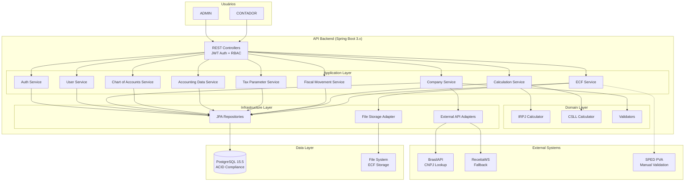

Arquitetura-de-Alto-Nível

### Resumo Técnico

O Sistema LALUR V2 ECF é uma **API REST backend monolítica modular** construída com **Java 21 + Spring Boot 3.x**, seguindo **arquitetura hexagonal (Ports & Adapters)** com 8 bounded contexts. O sistema utiliza **PostgreSQL 15+** como banco de dados relacional com conformidade ACID, essencial para garantir integridade em cálculos fiscais (IRPJ/CSLL). A arquitetura é **multi-tenant** (header `X-Company-Id`), com autenticação **JWT stateless** e dois roles (ADMIN e CONTADOR). A solução foi desenhada para atingir os objetivos do PRD: **reduzir tempo de processamento em 70%** (de 8-16h para 2-5h), **precisão >99.5%** nos cálculos tributários, e **suportar múltiplas empresas** de forma escalável. O deploy inicial utiliza **Docker Compose** com PostgreSQL containerizado, e CI/CD via **GitHub Actions**.

### Visão Geral da Arquitetura

1. **Estilo Arquitetural:** Monolito Modular
   - Aplicação única (single deployment)
   - Organização interna em 8 bounded contexts (DDD)
   - Comunicação síncrona entre módulos via chamadas diretas
   - Transações ACID garantidas por banco relacional único

2. **Estrutura de Repositório:** Monorepo
   - Único repositório Git
   - Todos os bounded contexts no mesmo codebase
   - Build único via Maven
   - Deploy único via Docker Compose

3. **Arquitetura de Serviço:** API RESTful Backend
   - Endpoints REST para todas operações (Seção 8 - OpenAPI spec)
   - Stateless (sem sessão server-side)
   - JSON como formato de troca de dados (camelCase convention)

4. **Fluxo de Interação do Usuário (High-Level):**
   ```
   Usuário (Postman/Swagger UI/Frontend futuro)
         ↓
   REST API (Spring Boot) - Autenticação JWT
         ↓
   Application Services (Use Cases) - Orquestração
         ↓
   Domain Services (Calculators) - Lógica de negócio pura
         ↓
   Repository Adapters (JPA) - Persistência
         ↓
   PostgreSQL Database
   ```

5. **Decisões Arquiteturais Chave:**
   - **Hexagonal Architecture:** Isolamento de domínio, testabilidade máxima, flexibilidade para trocar infraestrutura
   - **Monolito Modular vs Microservices:** Simplicidade inicial, deploy único, transações ACID, menor overhead operacional no MVP
   - **PostgreSQL:** Conformidade ACID crítica para cálculos fiscais, suporte robusto a constraints e transações
   - **JWT Stateless:** Escalabilidade horizontal, sem state no servidor, tokens de curta duração (15min access, 7 dias refresh)
   - **Multi-tenant via Header:** Simplicidade (sem schema separation), isolamento lógico via queries filtradas

### Diagrama de Alto Nível



### Padrões Arquiteturais e de Design

- **Hexagonal Architecture (Ports & Adapters):** Isolamento do domínio de detalhes técnicos (frameworks, databases, APIs). Domain layer não conhece Spring/JPA. - _Rationale:_ Garante testabilidade máxima (domain services testáveis sem Spring Context), flexibilidade para trocar infraestrutura (ex: migrar PostgreSQL → MongoDB sem tocar domain), e longevidade do código de negócio.

- **Repository Pattern:** Abstração de acesso a dados via interfaces (ports) implementadas por adapters JPA. - _Rationale:_ Permite testar application services com repositories mockados, e futuramente migrar de JPA para outro mecanismo de persistência sem alterar camadas superiores.

- **Dependency Injection (Spring):** Injeção de dependências via construtores (@RequiredArgsConstructor do Lombok). - _Rationale:_ Inversão de controle facilita testes (injetar mocks), e reduz acoplamento entre componentes.

- **DTO Pattern (Data Transfer Objects):** Separação entre JPA Entities, Domain Models e DTOs de API. - _Rationale:_ Evita expor detalhes internos (lazy loading, campos de auditoria) na API, permite evolução independente de camadas, e previne over-fetching/under-fetching.

- **Soft Delete Pattern:** Status enum (ACTIVE/INACTIVE) em todas entidades ao invés de DELETE físico. - _Rationale:_ Auditoria completa, recovery de dados, conformidade com LGPD (direito ao esquecimento via anonimização após soft delete).

- **Strategy Pattern:** Calculators isolados (IrpjCalculator, CsllCalculator) como estratégias intercambiáveis. - _Rationale:_ Facilita adição de novos tipos de cálculo (ex: PIS/COFINS futuro), testes unitários isolados, e conformidade com Single Responsibility Principle.

- **Command Pattern:** Use Cases representam comandos executáveis (CalculateIrpjUseCase, ImportAccountingDataUseCase). - _Rationale:_ Cada use case é uma unidade atômica de funcionalidade, facilitando auditoria, retry logic, e event sourcing futuro.

- **Event-Driven Architecture (Interno):** Invalidação de cálculos via eventos Spring (ApplicationEventPublisher). - _Rationale:_ Desacoplamento entre módulos (FiscalMovementService publica evento, CalculationService escuta e invalida), extensibilidade (adicionar novos listeners sem modificar código existente).

---

