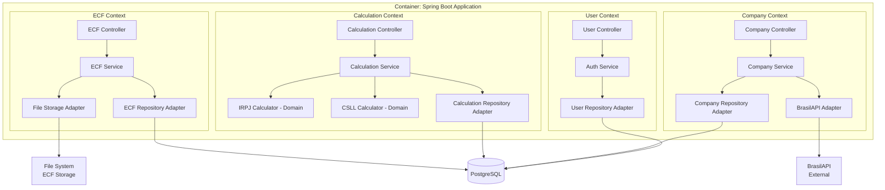

Componentes

### Bounded Contexts e Estrutura Hexagonal

O sistema está organizado em **8 bounded contexts** seguindo Domain-Driven Design (DDD). Cada contexto implementa **arquitetura hexagonal** com 3 camadas:

1. **Domain Layer:** Lógica de negócio pura (POJOs, calculators, validators) - sem dependências de frameworks
2. **Application Layer:** Orquestração de casos de uso (services, ports/interfaces)
3. **Infrastructure Layer:** Adapters (REST controllers, JPA repositories, external APIs)

---

#### 1. User Context (Autenticação e Gestão de Usuários)

**Responsabilidade:** Gerenciar autenticação JWT, autorização RBAC (ADMIN/CONTADOR), CRUD de usuários, troca/reset de senhas.

**Principais Interfaces (Ports IN):**
- `AuthenticateUserUseCase` - Login com email/senha, gerar tokens JWT
- `ChangePasswordUseCase` - Troca de senha obrigatória (primeiro acesso)
- `CreateUserUseCase` - ADMIN cria usuários (ADMIN ou CONTADOR)
- `ListUsersUseCase` - Listar usuários com paginação e busca
- `GetUserUseCase` - Visualizar detalhes de usuário
- `UpdateUserUseCase` - Editar dados de usuário
- `ToggleUserStatusUseCase` - Ativar/inativar usuário (soft delete)
- `ResetUserPasswordUseCase` - ADMIN redefine senha (força `mustChangePassword=true`)

**Dependências:**
- `UserRepositoryPort` (acesso a database)
- `BCryptPasswordEncoder` (hashing de senhas)
- `JwtTokenProvider` (geração/validação de tokens)

**Stack Tecnológico:**
- Spring Security 6.2.1 (RBAC, @PreAuthorize)
- Auth0 java-jwt 4.4.0 (JWT)
- BCrypt strength 12

**Endpoints REST:**
- `POST /api/v1/auth/login` - Login (public)
- `POST /api/v1/auth/change-password` - Trocar senha (autenticado)
- `POST /api/v1/users` - Criar usuário (ADMIN only)
- `GET /api/v1/users` - Listar usuários (ADMIN only)
- `GET /api/v1/users/{id}` - Visualizar usuário (ADMIN only)
- `PUT /api/v1/users/{id}` - Editar usuário (ADMIN only)
- `PATCH /api/v1/users/{id}/status` - Toggle status (ADMIN only)
- `POST /api/v1/users/{id}/reset-password` - Reset senha (ADMIN only)

---

#### 2. Company Context (Gestão de Empresas)

**Responsabilidade:** CRUD de empresas, validação de CNPJ via APIs externas (BrasilAPI/ReceitaWS), gestão de período contábil.

**Principais Interfaces:**
- `CreateCompanyUseCase` - Criar empresa com validação CNPJ
- `SearchCnpjUseCase` - Buscar dados de CNPJ em APIs externas
- `UpdatePeriodoContabilUseCase` - Atualizar período contábil (lock de dados)
- `ListCompaniesUseCase` - Listar empresas (ADMIN: todas, CONTADOR: apenas suas)
- `GetCompanyUseCase` - Visualizar detalhes de empresa

**Dependências:**
- `CompanyRepositoryPort`
- `CnpjApiPort` (abstração BrasilAPI/ReceitaWS)

**Stack Tecnológico:**
- Spring WebClient 6.1.2 (chamadas HTTP assíncronas)
- BrasilAPI: `https://brasilapi.com.br/api/cnpj/v1/{cnpj}` (timeout 10s)
- ReceitaWS (fallback): `https://www.receitaws.com.br/v1/cnpj/{cnpj}` (timeout 15s)

**Endpoints REST:**
- `POST /api/v1/companies` - Criar empresa
- `GET /api/v1/companies` - Listar empresas
- `GET /api/v1/companies/{id}` - Visualizar empresa
- `PUT /api/v1/companies/{id}` - Editar empresa
- `PATCH /api/v1/companies/{id}/periodo-contabil` - Atualizar período
- `GET /api/v1/companies/search-cnpj/{cnpj}` - Buscar CNPJ (BrasilAPI)

**Integração Externa - BrasilAPI/ReceitaWS:**
```java
@Component
public class BrasilApiCnpjAdapter implements CnpjApiPort {
    private final WebClient webClient;

    @Cacheable(value = "cnpjCache", key = "#cnpj")
    public Optional<CnpjData> searchCnpj(String cnpj) {
        try {
            return webClient.get()
                .uri("/cnpj/v1/{cnpj}", cnpj)
                .retrieve()
                .bodyToMono(CnpjResponse.class)
                .timeout(Duration.ofSeconds(10))
                .blockOptional();
        } catch (TimeoutException e) {
            return receitaWsFallback.searchCnpj(cnpj); // Fallback
        }
    }
}
```

---

#### 3. Chart of Accounts Context (Plano de Contas)

**Responsabilidade:** Importar/exportar plano de contas via CSV, CRUD de contas contábeis.

**Principais Interfaces:**
- `ImportChartOfAccountsUseCase` - Upload CSV com plano de contas
- `ExportChartOfAccountsUseCase` - Download CSV do plano atual
- `CreateChartOfAccountUseCase` - Criar conta individual
- `ListChartOfAccountsUseCase` - Listar contas por empresa

**Dependências:**
- `ChartOfAccountRepositoryPort`
- `CsvParser` (Apache Commons CSV)

**Stack Tecnológico:**
- Apache Commons CSV 1.10.0

**Endpoints REST:**
- `POST /api/v1/companies/{companyId}/chart-of-accounts/import` - Upload CSV
- `GET /api/v1/companies/{companyId}/chart-of-accounts/export` - Download CSV
- `POST /api/v1/companies/{companyId}/chart-of-accounts` - Criar conta
- `GET /api/v1/companies/{companyId}/chart-of-accounts` - Listar contas

**Formato CSV:**
```csv
code,name,accountType
1.01.01.001,Caixa,ATIVO
1.01.01.002,Bancos,ATIVO
2.01.01.001,Fornecedores,PASSIVO
```

---

#### 4. Tax Parameter Context (Parâmetros Fiscais)

**Responsabilidade:** CRUD de parâmetros fiscais globais (ADMIN only) - alíquotas, limites, configurações.

**Principais Interfaces:**
- `ManageTaxParametersUseCase` - CRUD completo de parâmetros

**Dependências:**
- `TaxParameterRepositoryPort`

**Endpoints REST:**
- `POST /api/v1/tax-parameters` - Criar parâmetro (ADMIN)
- `GET /api/v1/tax-parameters` - Listar parâmetros (ADMIN)
- `PUT /api/v1/tax-parameters/{id}` - Editar parâmetro (ADMIN)
- `DELETE /api/v1/tax-parameters/{id}` - Inativar parâmetro (ADMIN)

**Seed Data (Inicialização):**
- IRPJ_ALIQUOTA_BASE: 15%
- IRPJ_ALIQUOTA_ADICIONAL: 10%
- IRPJ_LIMITE_ADICIONAL_MENSAL: R$ 20.000
- CSLL_ALIQUOTA: 9%

---

#### 5. Accounting Data Context (Dados Contábeis)

**Responsabilidade:** Importar/exportar dados contábeis mensais (balancetes) via CSV com UPSERT automático.

**Principais Interfaces:**
- `ImportAccountingDataUseCase` - Upload CSV de balancete (UPSERT via unique constraint)
- `ExportAccountingDataUseCase` - Download CSV de período específico
- `ListAccountingDataUseCase` - Listar dados por período

**Dependências:**
- `AccountingDataRepositoryPort`
- `ChartOfAccountRepositoryPort` (validar contas existem)
- `CsvParser`

**Endpoints REST:**
- `POST /api/v1/companies/{companyId}/accounting-data/import` - Upload CSV
- `GET /api/v1/companies/{companyId}/accounting-data/export` - Download CSV
- `GET /api/v1/companies/{companyId}/accounting-data` - Listar dados

**Performance:**
- Batch inserts (1000 linhas por transaction)
- UPSERT via `INSERT ... ON CONFLICT UPDATE` (PostgreSQL)
- Target: 10k linhas em < 30s

**Formato CSV:**
```csv
chartOfAccountCode,competencia,saldoInicial,debito,credito,saldoFinal
1.01.01.001,2024-01,50000.00,10000.00,5000.00,55000.00
1.01.01.002,2024-01,100000.00,20000.00,15000.00,105000.00
```

---

#### 6. LALUR Context (Movimentos Fiscais)

**Responsabilidade:** CRUD de adições/exclusões LALUR e LACS, publicação de eventos de invalidação de cálculos.

**Principais Interfaces:**
- `CreateFiscalMovementUseCase` - Criar movimento (publica evento)
- `UpdateFiscalMovementUseCase` - Editar movimento (publica evento)
- `DeleteFiscalMovementUseCase` - Inativar movimento (publica evento)
- `ListFiscalMovementsUseCase` - Listar por empresa e ano

**Dependências:**
- `FiscalMovementRepositoryPort`
- `CalculationInvalidationEventPublisher`

**Endpoints REST:**
- `POST /api/v1/companies/{companyId}/fiscal-movements` - Criar movimento
- `GET /api/v1/companies/{companyId}/fiscal-movements` - Listar
- `PUT /api/v1/companies/{companyId}/fiscal-movements/{id}` - Editar
- `DELETE /api/v1/companies/{companyId}/fiscal-movements/{id}` - Inativar

**Event-Driven Invalidation:**
```java
@Service
public class FiscalMovementService {

    @Transactional
    public FiscalMovement create(CreateFiscalMovementCommand cmd) {
        FiscalMovement movement = repository.save(cmd.toDomain());

        // Publicar evento para invalidar cálculos
        eventPublisher.publish(new CalculationInvalidationEvent(
            cmd.getCompanyId(),
            cmd.getFiscalYear(),
            movement.getMovementType() // LALUR ou LACS
        ));

        return movement;
    }
}
```

---

#### 7. Calculation Context (Motores de Cálculo)

**Responsabilidade:** Calcular IRPJ/CSLL usando IrpjCalculator e CsllCalculator (domain services puros), invalidar cálculos desatualizados via eventos.

**Principais Interfaces:**
- `CalculateIrpjUseCase` - Calcular IRPJ para ano fiscal
- `CalculateCsllUseCase` - Calcular CSLL para ano fiscal
- `RecalculateAllUseCase` - Recalcular todos cálculos outdated
- `GetOutdatedCalculationsUseCase` - Listar cálculos desatualizados

**Dependências:**
- `TaxCalculationResultRepositoryPort`
- `FiscalMovementRepositoryPort`
- `AccountingDataRepositoryPort`
- `TaxParameterRepositoryPort`
- `IrpjCalculator` (domain service)
- `CsllCalculator` (domain service)

**Domain Services (Pure Logic):**
```java
// domain/service/calculator/IrpjCalculator.java
public class IrpjCalculator {

    public TaxCalculationResult calculate(CalculationInput input) {
        BigDecimal lucroContabil = input.getLucroLiquido();
        List<FiscalMovement> movements = input.getMovements();

        // Aplicar adições e exclusões
        BigDecimal lucroReal = lucroContabil;
        for (FiscalMovement m : movements) {
            if (m.getClassification() == ADICAO) {
                lucroReal = lucroReal.add(m.getAmount());
            } else {
                lucroReal = lucroReal.subtract(m.getAmount());
            }
        }

        // IRPJ base: 15%
        BigDecimal irpjBase = lucroReal.multiply(new BigDecimal("0.15"));

        // IRPJ adicional: 10% sobre parcela > R$ 240k/ano
        BigDecimal threshold = new BigDecimal("240000");
        BigDecimal irpjAdicional = lucroReal.compareTo(threshold) > 0
            ? lucroReal.subtract(threshold).multiply(new BigDecimal("0.10"))
            : BigDecimal.ZERO;

        BigDecimal totalIrpj = irpjBase.add(irpjAdicional);

        return new TaxCalculationResult(lucroReal, totalIrpj, buildMemory(...));
    }
}
```

**Endpoints REST:**
- `POST /api/v1/companies/{companyId}/calculations/irpj` - Calcular IRPJ
- `POST /api/v1/companies/{companyId}/calculations/csll` - Calcular CSLL
- `POST /api/v1/companies/{companyId}/calculations/recalculate-all` - Recalcular outdated
- `GET /api/v1/companies/{companyId}/calculations/outdated-status` - Status de desatualização

**Event Listener (Invalidação Automática):**
```java
@Component
public class CalculationInvalidationListener {

    @EventListener
    @Transactional
    public void onFiscalMovementChanged(CalculationInvalidationEvent event) {
        // Marcar cálculos como outdated
        calculationRepository.markAsOutdated(
            event.getCompanyId(),
            event.getFiscalYear(),
            event.getCalculationType()
        );

        log.info("Cálculos invalidados: company={}, year={}, type={}",
            event.getCompanyId(), event.getFiscalYear(), event.getCalculationType());
    }
}
```

---

#### 8. ECF Context (Geração e Validação de ECF)

**Responsabilidade:** Upload de ECF importado (Parte A), geração de arquivo M (Parte M com LALUR/LACS), merge para ECF completo, validação interna, download.

**Principais Interfaces:**
- `UploadImportedEcfUseCase` - Upload arquivo ECF importado
- `GenerateMFileUseCase` - Gerar arquivo M completo (M001 + M300 + M350 + M400 + M410 + M990)
- `GenerateCompleteEcfUseCase` - Merge ECF importado + M file (substituição simples em |M001|)
- `ValidateEcfUseCase` - Validação interna (regras básicas)
- `DownloadEcfUseCase` - Download de arquivo gerado

**Dependências:**
- `EcfFileRepositoryPort`
- `TaxCalculationResultRepositoryPort`
- `FileStoragePort` (abstração filesystem/S3)
- `EcfFileParser`

**Endpoints REST:**
- `POST /api/v1/companies/{companyId}/ecf/upload-imported` - Upload ECF (Parte A)
- `POST /api/v1/companies/{companyId}/ecf/generate-m-file` - Gerar M file
- `POST /api/v1/companies/{companyId}/ecf/generate-complete` - Gerar ECF completo
- `POST /api/v1/companies/{companyId}/ecf/{fileId}/validate` - Validar
- `GET /api/v1/companies/{companyId}/ecf/{fileId}/download` - Download

**Merge Strategy (Simple Replacement):**
```
linhasEcfImportado = lerArquivo(ecfImportado)
linhasArquivoM = lerArquivo(arquivoM)

indexM001 = encontrarPrimeiraLinha(linhasEcfImportado, inicia com "|M001|")

se (indexM001 encontrado):
    parteA = linhasEcfImportado[0 até indexM001-1]  // Tudo antes de M001
senão:
    parteA = linhasEcfImportado  // Arquivo completo (não tinha Parte M)

ecfCompleto = parteA + linhasArquivoM
salvar(ecfCompleto)
```

---

### Diagrama de Componentes (C4 Container)



---

