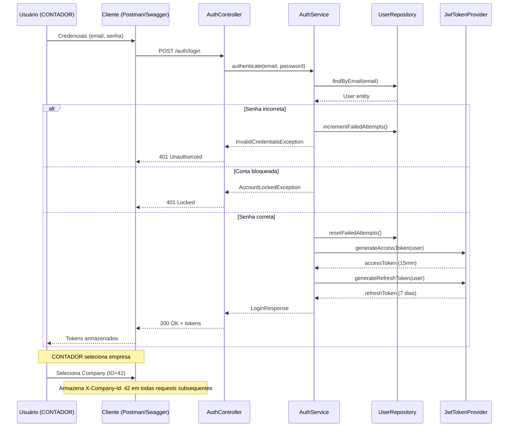
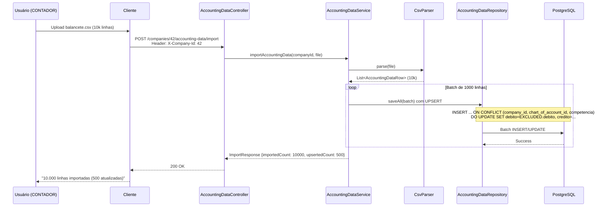
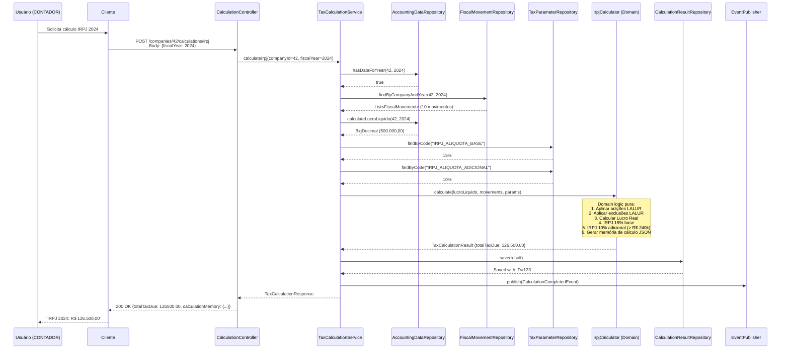
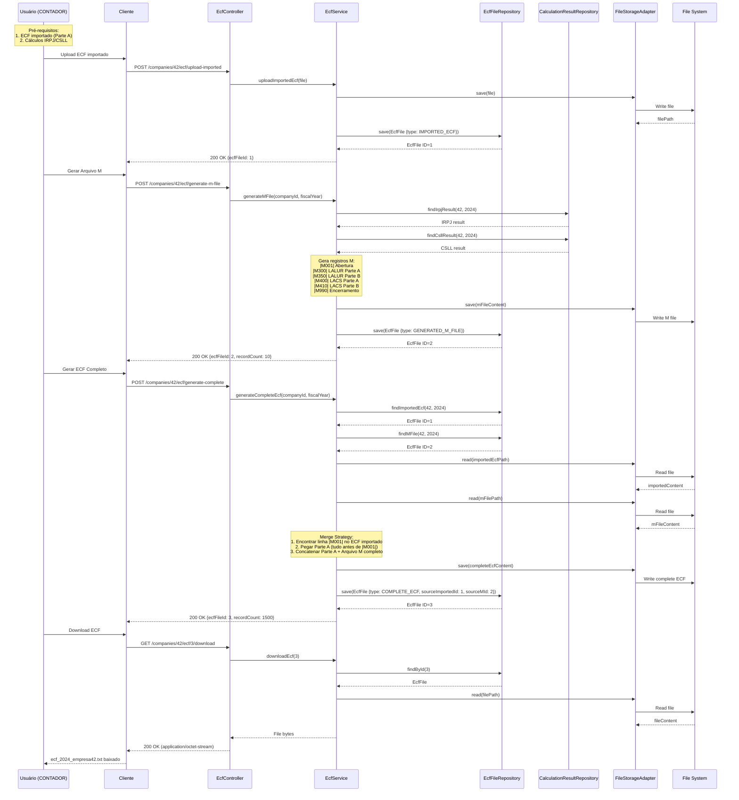
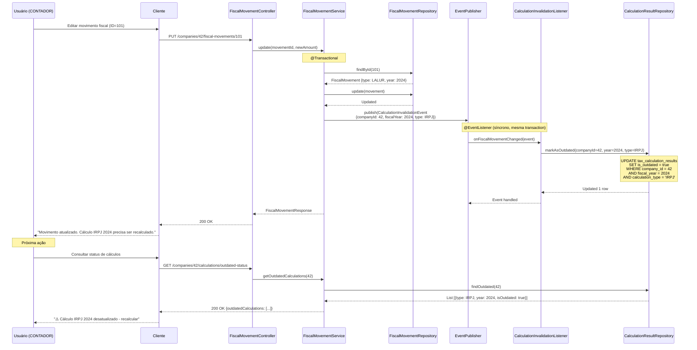

Workflows-Principais

### 1. Login e Seleção de Empresa



---

### 2. Importação de Balancete CSV



**Performance:**
- Batch size: 1000 linhas por transaction
- UPSERT via unique constraint (idempotente)
- Target: 10k linhas em < 30s

---

### 3. Cálculo IRPJ



**Memória de Cálculo JSON:**
```json
{
  "calculationId": "calc-123-irpj-2024",
  "fiscalMovementIds": [101, 102, 105, 110, 115, 120, 125, 130, 135, 140],
  "steps": [
    {"step": 1, "description": "Lucro Líquido Contábil", "value": 500000.00},
    {"step": 2, "description": "Adições LALUR (10 movimentos)", "value": 50000.00},
    {"step": 3, "description": "Exclusões LALUR", "value": -20000.00},
    {"step": 4, "description": "Lucro Real (Base de Cálculo)", "value": 530000.00},
    {"step": 5, "description": "IRPJ Base 15%", "value": 79500.00},
    {"step": 6, "description": "IRPJ Adicional 10% (sobre R$ 290k)", "value": 29000.00},
    {"step": 7, "description": "IRPJ Total Devido", "value": 108500.00}
  ]
}
```

---

### 4. Geração de ECF Completo



---

### 5. Invalidação Automática de Cálculos



---

