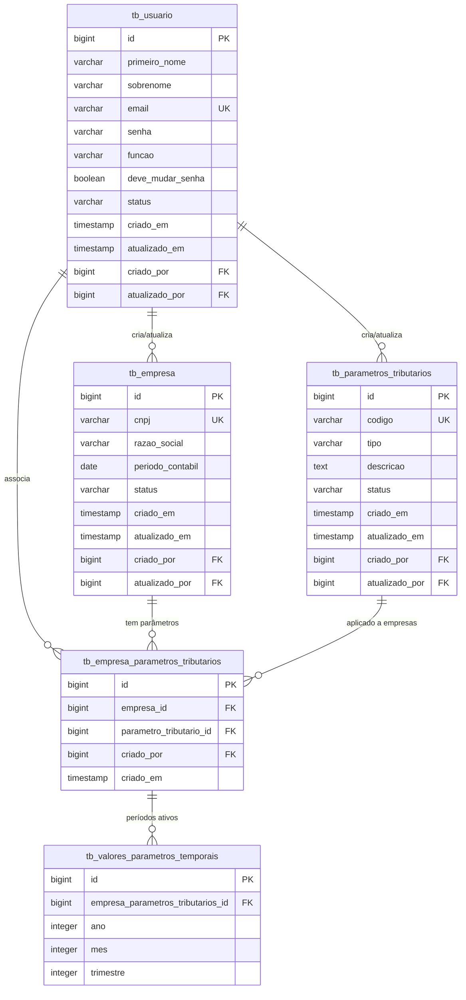

# 9. Database Schema

> **⚠️ Atualizado conforme [ADR-001: Simplificação do Modelo de Dados](adr-001-simplificacao-modelo-dados.md)**
>
> **Versão:** v2.1 (2025-10-25)
>
> **Mudanças principais:**
> - Nomenclatura snake_case em todas as tabelas e colunas
> - TaxParameter simplificado (sem hierarquia)
> - Nova tabela `tb_empresa_parametros_tributarios` com auditoria
> - Nova tabela `tb_valores_parametros_temporais` para parâmetros mensais/trimestrais

## PostgreSQL DDL Completo

```sql
-- ============================================================================
-- Sistema LALUR V2 ECF - Database Schema
-- PostgreSQL 12+
-- Encoding: UTF-8
-- Timezone: UTC
-- Versão: 2.0 (ADR-001)
-- ============================================================================

-- ============================================================================
-- 1. TABELA USER (tb_usuario)
-- ============================================================================

CREATE TABLE tb_usuario (
    id BIGSERIAL PRIMARY KEY,

    -- Dados pessoais
    primeiro_nome VARCHAR(100) NOT NULL,
    sobrenome VARCHAR(100) NOT NULL,
    email VARCHAR(255) NOT NULL UNIQUE,

    -- Autenticação
    senha VARCHAR(255) NOT NULL, -- BCrypt hash (60 chars)
    funcao VARCHAR(20) NOT NULL CHECK (funcao IN ('ADMIN', 'CONTADOR')),
    deve_mudar_senha BOOLEAN NOT NULL DEFAULT TRUE,

    -- Campos de auditoria
    status VARCHAR(20) NOT NULL DEFAULT 'ACTIVE' CHECK (status IN ('ACTIVE', 'INACTIVE')),
    criado_em TIMESTAMP NOT NULL DEFAULT CURRENT_TIMESTAMP,
    atualizado_em TIMESTAMP NOT NULL DEFAULT CURRENT_TIMESTAMP,
    criado_por BIGINT REFERENCES tb_usuario(id),
    atualizado_por BIGINT REFERENCES tb_usuario(id)
);

CREATE INDEX idx_usuario_email ON tb_usuario(email);
CREATE INDEX idx_usuario_funcao ON tb_usuario(funcao);
CREATE INDEX idx_usuario_status ON tb_usuario(status);

COMMENT ON TABLE tb_usuario IS 'Usuários do sistema (ADMIN e CONTADOR)';
COMMENT ON COLUMN tb_usuario.deve_mudar_senha IS 'Flag para forçar troca de senha no próximo login';

-- ============================================================================
-- 2. TABELA COMPANY (tb_empresa)
-- ============================================================================

CREATE TABLE tb_empresa (
    id BIGSERIAL PRIMARY KEY,

    -- Dados cadastrais
    cnpj VARCHAR(14) NOT NULL UNIQUE, -- 14 dígitos sem formatação
    razao_social VARCHAR(255) NOT NULL,

    -- Período contábil (data de corte para bloqueio de edições)
    periodo_contabil DATE NOT NULL,

    -- Campos de auditoria
    status VARCHAR(20) NOT NULL DEFAULT 'ACTIVE' CHECK (status IN ('ACTIVE', 'INACTIVE')),
    criado_em TIMESTAMP NOT NULL DEFAULT CURRENT_TIMESTAMP,
    atualizado_em TIMESTAMP NOT NULL DEFAULT CURRENT_TIMESTAMP,
    criado_por BIGINT REFERENCES tb_usuario(id),
    atualizado_por BIGINT REFERENCES tb_usuario(id)
);

CREATE INDEX idx_empresa_cnpj ON tb_empresa(cnpj);
CREATE INDEX idx_empresa_periodo ON tb_empresa(periodo_contabil);
CREATE INDEX idx_empresa_status ON tb_empresa(status);

COMMENT ON TABLE tb_empresa IS 'Empresas gerenciadas no sistema (multi-tenant)';
COMMENT ON COLUMN tb_empresa.periodo_contabil IS 'Dados com competência anterior não podem ser editados';

-- ============================================================================
-- 3. TABELA TAX_PARAMETER (tb_parametros_tributarios)
-- ADR-001: Estrutura simplificada (flat) - SEM hierarquia parent/child
-- ============================================================================

CREATE TABLE tb_parametros_tributarios (
    id BIGSERIAL PRIMARY KEY,

    -- Identificação
    codigo VARCHAR(100) NOT NULL UNIQUE, -- Ex: "IRPJ_ADICAO_01"
    tipo VARCHAR(50) NOT NULL,           -- Ex: 'IRPJ', 'CSLL', 'GERAL'
    descricao TEXT,

    -- Campos de auditoria
    status VARCHAR(20) NOT NULL DEFAULT 'ACTIVE' CHECK (status IN ('ACTIVE', 'INACTIVE')),
    criado_em TIMESTAMP NOT NULL DEFAULT CURRENT_TIMESTAMP,
    atualizado_em TIMESTAMP NOT NULL DEFAULT CURRENT_TIMESTAMP,
    criado_por BIGINT REFERENCES tb_usuario(id),
    atualizado_por BIGINT REFERENCES tb_usuario(id)
);

CREATE INDEX idx_parametro_codigo ON tb_parametros_tributarios(codigo);
CREATE INDEX idx_parametro_tipo ON tb_parametros_tributarios(tipo);
CREATE INDEX idx_parametro_status ON tb_parametros_tributarios(status);

COMMENT ON TABLE tb_parametros_tributarios IS 'Parâmetros tributários globais (estrutura flat conforme ADR-001)';
COMMENT ON COLUMN tb_parametros_tributarios.tipo IS 'Categoria do parâmetro (ex: IRPJ, CSLL, GERAL)';

-- ============================================================================
-- 4. TABELA ASSOCIATIVA COMPANY ↔ TAX_PARAMETER (tb_empresa_parametros_tributarios)
-- ADR-001: Tabela explícita com auditoria (substitui @ManyToMany automático)
-- ============================================================================

CREATE TABLE tb_empresa_parametros_tributarios (
    id BIGSERIAL PRIMARY KEY,

    -- Foreign keys
    empresa_id BIGINT NOT NULL REFERENCES tb_empresa(id) ON DELETE CASCADE,
    parametro_tributario_id BIGINT NOT NULL REFERENCES tb_parametros_tributarios(id) ON DELETE RESTRICT,

    -- Auditoria (somente criação - associações são imutáveis)
    criado_por BIGINT REFERENCES tb_usuario(id),
    criado_em TIMESTAMP NOT NULL DEFAULT CURRENT_TIMESTAMP,

    -- Constraint de unicidade
    UNIQUE (empresa_id, parametro_tributario_id)
);

CREATE INDEX idx_empresa_param_empresa ON tb_empresa_parametros_tributarios(empresa_id);
CREATE INDEX idx_empresa_param_parametro ON tb_empresa_parametros_tributarios(parametro_tributario_id);
CREATE INDEX idx_empresa_param_criado_em ON tb_empresa_parametros_tributarios(criado_em);

COMMENT ON TABLE tb_empresa_parametros_tributarios IS 'Associação Company ↔ TaxParameter com auditoria completa (ADR-001)';
COMMENT ON COLUMN tb_empresa_parametros_tributarios.criado_por IS 'Usuário (ADMIN) que fez a associação';
COMMENT ON CONSTRAINT tb_empresa_parametros_tributarios_empresa_id_parametro_tributario_id_key
    ON tb_empresa_parametros_tributarios IS 'Previne associações duplicadas';

-- ============================================================================
-- 5. TABELA VALORES TEMPORAIS DE PARÂMETROS (tb_valores_parametros_temporais)
-- ADR-001: Suporte a parâmetros que variam por período (mensal ou trimestral)
-- ============================================================================

CREATE TABLE tb_valores_parametros_temporais (
    id BIGSERIAL PRIMARY KEY,

    -- Foreign key para associação empresa↔parâmetro
    empresa_parametros_tributarios_id BIGINT NOT NULL
        REFERENCES tb_empresa_parametros_tributarios(id) ON DELETE CASCADE,

    -- Período temporal
    ano INTEGER NOT NULL,
    mes INTEGER CHECK (mes IS NULL OR (mes >= 1 AND mes <= 12)),
    trimestre INTEGER CHECK (trimestre IS NULL OR (trimestre >= 1 AND trimestre <= 4)),

    -- Constraint de unicidade temporal
    UNIQUE (empresa_parametros_tributarios_id, ano, mes, trimestre),

    -- Constraint de exclusividade: ou mensal ou trimestral
    CHECK (
        (mes IS NOT NULL AND trimestre IS NULL) OR
        (mes IS NULL AND trimestre IS NOT NULL)
    )
);

CREATE INDEX idx_valores_temporais_empresa_param ON tb_valores_parametros_temporais(empresa_parametros_tributarios_id);
CREATE INDEX idx_valores_temporais_ano ON tb_valores_parametros_temporais(ano);
CREATE INDEX idx_valores_temporais_periodo ON tb_valores_parametros_temporais(ano, mes, trimestre);

COMMENT ON TABLE tb_valores_parametros_temporais IS 'Períodos (mensais ou trimestrais) em que parâmetros estão ativos (ADR-001)';
COMMENT ON COLUMN tb_valores_parametros_temporais.mes IS 'Mês (1-12) para periodicidade mensal, NULL para trimestral';
COMMENT ON COLUMN tb_valores_parametros_temporais.trimestre IS 'Trimestre (1-4) para periodicidade trimestral, NULL para mensal';

-- ============================================================================
-- 6. TRIGGERS DE AUDITORIA
-- ============================================================================

-- Function para atualizar updated_at automaticamente
CREATE OR REPLACE FUNCTION atualizar_timestamp_modificacao()
RETURNS TRIGGER AS $$
BEGIN
    NEW.atualizado_em = CURRENT_TIMESTAMP;
    RETURN NEW;
END;
$$ LANGUAGE plpgsql;

-- Trigger para tb_usuario
CREATE TRIGGER trg_usuario_atualizado_em
    BEFORE UPDATE ON tb_usuario
    FOR EACH ROW
    EXECUTE FUNCTION atualizar_timestamp_modificacao();

-- Trigger para tb_empresa
CREATE TRIGGER trg_empresa_atualizado_em
    BEFORE UPDATE ON tb_empresa
    FOR EACH ROW
    EXECUTE FUNCTION atualizar_timestamp_modificacao();

-- Trigger para tb_parametros_tributarios
CREATE TRIGGER trg_parametro_atualizado_em
    BEFORE UPDATE ON tb_parametros_tributarios
    FOR EACH ROW
    EXECUTE FUNCTION atualizar_timestamp_modificacao();

-- ============================================================================
-- 6. DADOS INICIAIS (SEED)
-- ============================================================================

-- Usuário ADMIN padrão (senha: "admin123" - BCrypt strength 12)
INSERT INTO tb_usuario (primeiro_nome, sobrenome, email, senha, funcao, deve_mudar_senha, status)
VALUES (
    'Admin',
    'Sistema',
    'admin@lalur.com',
    '$2a$12$LQv3c1yqBWVHxkd0LHAkCOYz6TtxMQJqhN8/LewY5GyYVq5W5V5W6', -- "admin123"
    'ADMIN',
    TRUE,
    'ACTIVE'
);

-- Parâmetros tributários exemplo
INSERT INTO tb_parametros_tributarios (codigo, tipo, descricao, status) VALUES
('IRPJ_ALIQUOTA_BASE', 'IRPJ', 'Alíquota base IRPJ - 15%', 'ACTIVE'),
('IRPJ_ALIQUOTA_ADICIONAL', 'IRPJ', 'Alíquota adicional IRPJ - 10% sobre lucro > 20k/mês', 'ACTIVE'),
('CSLL_ALIQUOTA', 'CSLL', 'Alíquota CSLL - 9%', 'ACTIVE'),
('LALUR_ADICAO_GENERICA', 'LALUR', 'Adição genérica LALUR', 'ACTIVE'),
('LACS_EXCLUSAO_GENERICA', 'LACS', 'Exclusão genérica LACS', 'ACTIVE');

COMMENT ON DATABASE lalur_v2_ecf IS 'Sistema LALUR V2 ECF - Escrituração Contábil Fiscal';

-- ============================================================================
-- 7. QUERIES DE VALIDAÇÃO
-- ============================================================================

-- Validar estrutura de tabelas criadas
SELECT
    table_name,
    (SELECT COUNT(*) FROM information_schema.columns WHERE table_name = t.table_name) as num_colunas
FROM information_schema.tables t
WHERE table_schema = 'public'
  AND table_type = 'BASE TABLE'
  AND table_name LIKE 'tb_%'
ORDER BY table_name;

-- Validar constraints de foreign key
SELECT
    tc.table_name,
    kcu.column_name,
    ccu.table_name AS foreign_table_name,
    ccu.column_name AS foreign_column_name
FROM information_schema.table_constraints AS tc
JOIN information_schema.key_column_usage AS kcu
    ON tc.constraint_name = kcu.constraint_name
    AND tc.table_schema = kcu.table_schema
JOIN information_schema.constraint_column_usage AS ccu
    ON ccu.constraint_name = tc.constraint_name
    AND ccu.table_schema = tc.table_schema
WHERE tc.constraint_type = 'FOREIGN KEY'
  AND tc.table_schema = 'public'
  AND tc.table_name LIKE 'tb_%'
ORDER BY tc.table_name;

-- Validar índices criados
SELECT
    tablename,
    indexname,
    indexdef
FROM pg_indexes
WHERE schemaname = 'public'
  AND tablename LIKE 'tb_%'
ORDER BY tablename, indexname;
```

## Diagrama ER (Mermaid)



## Mudanças vs Versão Anterior (ADR-001)

| Aspecto | Antes (v1.0) | Depois (v2.0 - ADR-001) |
|---------|--------------|--------------------------|
| **Tabela User** | `users` | `tb_usuario` (snake_case) |
| **Tabela Company** | `companies` | `tb_empresa` (snake_case) |
| **Tabela TaxParameter** | `tax_parameters` com `parent_id`, `children` | `tb_parametros_tributarios` (flat, sem hierarquia) |
| **Associação C↔TP** | Tabela implícita `company_tax_parameters` sem auditoria | **Nova:** `tb_empresa_parametros_tributarios` com `id`, `criado_por`, `criado_em` |
| **Nomenclatura colunas** | camelCase/snake_case misturado | **100% snake_case** |
| **Auditoria associação** | ❌ Não existia | ✅ `criado_por` + `criado_em` |
| **TaxParam.configuration** | JSON JSONB | ❌ Removido |
| **TaxParam.type** | Enum rígido | ✅ String flexível ('IRPJ', 'CSLL', etc.) |
| **Valores temporais** | ❌ Não existia | ✅ **Nova:** `tb_valores_parametros_temporais` para parâmetros mensais/trimestrais |

## Notas de Implementação

1. **JPA Entity Naming:**
   ```java
   @Entity
   @Table(name = "tb_usuario")
   class UserEntity {
       @Column(name = "primeiro_nome")
       private String firstName;

       @Column(name = "deve_mudar_senha")
       private Boolean mustChangePassword;
   }
   ```

2. **Auditoria em Associação:**
   ```java
   @Entity
   @Table(name = "tb_empresa_parametros_tributarios")
   class CompanyTaxParameterEntity {
       @Column(name = "empresa_id")
       private Long companyId;

       @Column(name = "criado_por")
       private Long createdBy; // Populado via SecurityContext
   }
   ```

3. **Valores Temporais:**
   ```java
   @Entity
   @Table(name = "tb_valores_parametros_temporais")
   class ValorParametroTemporalEntity {
       @Column(name = "empresa_parametros_tributarios_id")
       private Long empresaParametroId;

       @Column(name = "ano")
       private Integer ano;

       @Column(name = "mes")
       private Integer mes; // NULL se trimestral

       @Column(name = "trimestre")
       private Integer trimestre; // NULL se mensal

       @PrePersist
       @PreUpdate
       private void validatePeriodicity() {
           if ((mes == null && trimestre == null) || (mes != null && trimestre != null)) {
               throw new IllegalStateException("Deve ter mes OU trimestre, nunca ambos ou nenhum");
           }
       }
   }
   ```

4. **Migration Path (se migrar de v1.0):**
   ```sql
   -- Renomear tabelas
   ALTER TABLE users RENAME TO tb_usuario;
   ALTER TABLE companies RENAME TO tb_empresa;
   ALTER TABLE tax_parameters RENAME TO tb_parametros_tributarios;

   -- Criar nova tabela associativa
   CREATE TABLE tb_empresa_parametros_tributarios AS
   SELECT
       nextval('tb_empresa_parametros_tributarios_id_seq') as id,
       company_id as empresa_id,
       tax_parameter_id as parametro_tributario_id,
       1 as criado_por, -- ADMIN
       CURRENT_TIMESTAMP as criado_em
   FROM company_tax_parameters;

   -- Dropar tabela antiga
   DROP TABLE company_tax_parameters;
   ```

## Validação do Schema

Execute após criar o schema:

```bash
# Conectar ao PostgreSQL
psql -U ecf_user -d ecf_db

# Validar tabelas
\dt tb_*

# Validar estrutura de cada tabela
\d tb_usuario
\d tb_empresa
\d tb_parametros_tributarios
\d tb_empresa_parametros_tributarios

# Testar insert
INSERT INTO tb_usuario (primeiro_nome, sobrenome, email, senha, funcao)
VALUES ('Test', 'User', 'test@test.com', 'hash', 'CONTADOR');

SELECT * FROM tb_usuario WHERE email = 'test@test.com';
```

## Performance Considerations

- **Índice composto** em `tb_empresa_parametros_tributarios(empresa_id, parametro_tributario_id)` pode ser adicionado para queries específicas
- **Particionamento** de `tb_empresa` por `periodo_contabil` se volume crescer (>1M empresas)
- **Materialized View** para relatório de parâmetros por empresa mais comuns:
  ```sql
  CREATE MATERIALIZED VIEW mv_parametros_por_empresa AS
  SELECT
      e.id as empresa_id,
      e.razao_social,
      COUNT(ctp.parametro_tributario_id) as qtd_parametros,
      ARRAY_AGG(tp.codigo) as codigos_parametros
  FROM tb_empresa e
  LEFT JOIN tb_empresa_parametros_tributarios ctp ON e.id = ctp.empresa_id
  LEFT JOIN tb_parametros_tributarios tp ON ctp.parametro_tributario_id = tp.id
  WHERE e.status = 'ACTIVE'
  GROUP BY e.id, e.razao_social;

  -- Refresh periódico
  REFRESH MATERIALIZED VIEW mv_parametros_por_empresa;
  ```
